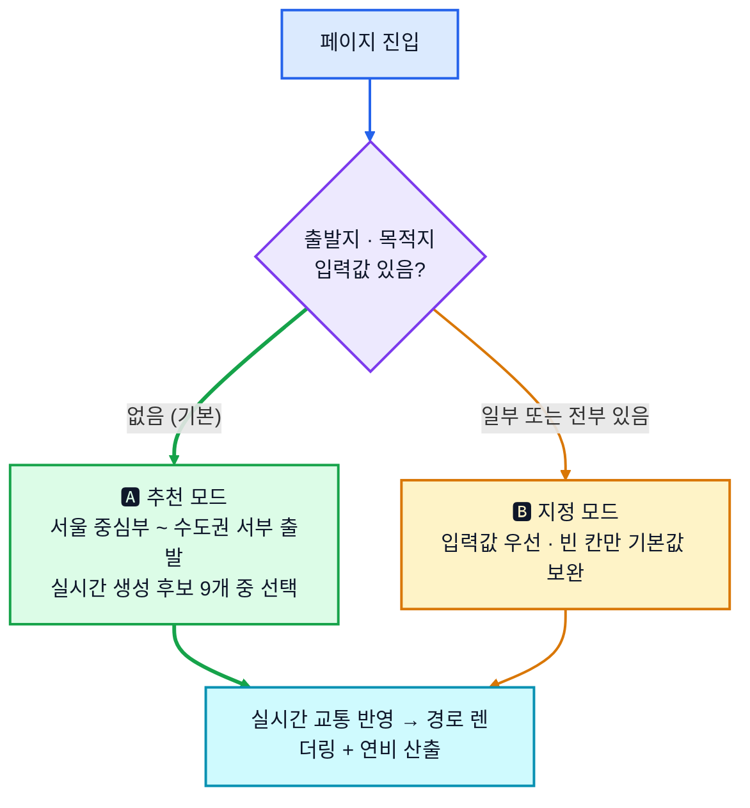
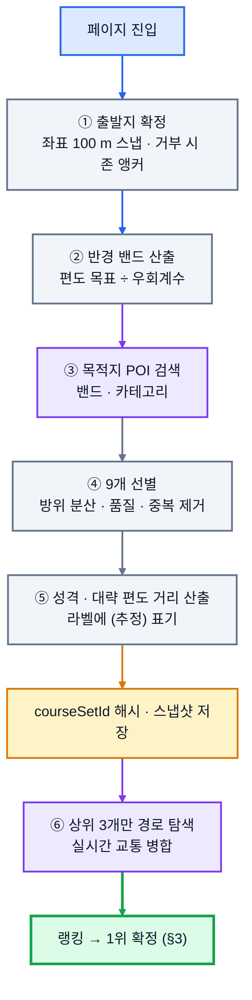
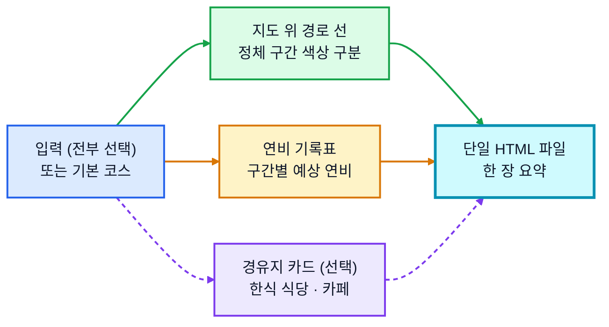
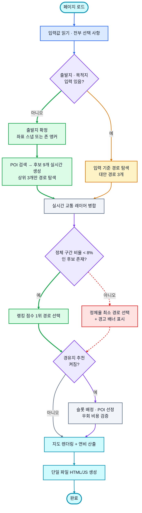
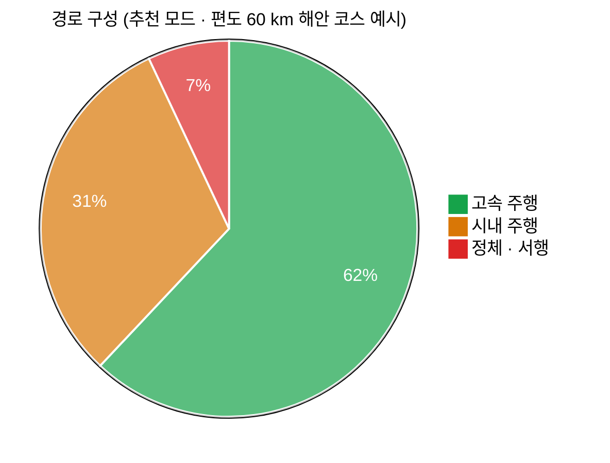
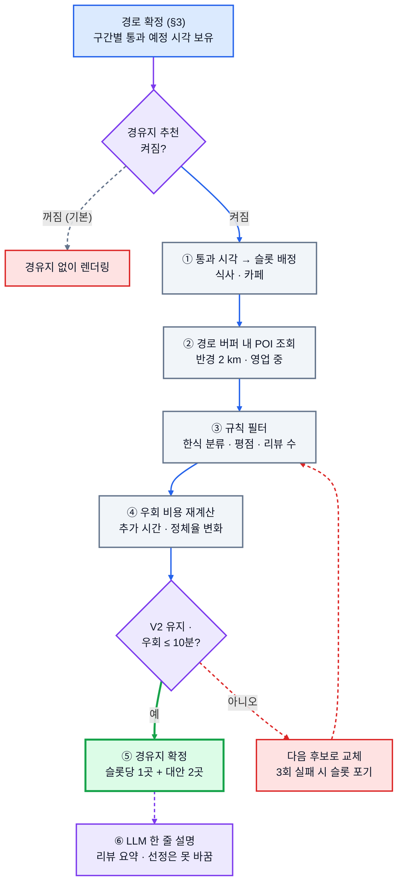
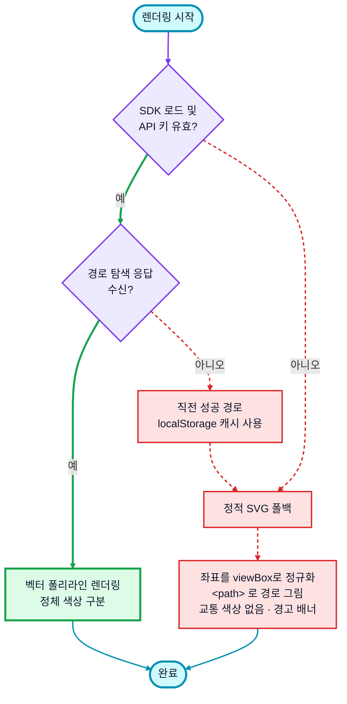
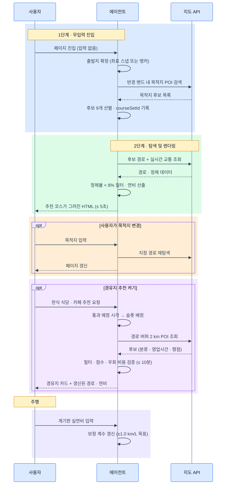

# 🚗 주말 드라이브 코스 & 연비 리포터

주말 드라이브를 즐기는 운전자를 위해 **막히지 않는 코스 탐색**과 **연비 기록**을
한 장의 웹페이지로 정리해 주는 에이전트입니다.

**아무것도 입력하지 않아도** 서울 중심부 ~ 수도권 서부 기준으로 코스를 **그 자리에서 만들어** 그려 줍니다.
원하면 **가고 오는 길의 한식 식당과 카페**까지 같은 페이지에 얹습니다.

---

## 1. 도메인 맥락

| 항목 | 내용 |
| --- | --- |
| 사용자 | 주말에 드라이브를 즐기는 개인 운전자 |
| 문제 | 매번 정체 구간을 피할 코스를 새로 찾아야 하고, 연비 기록이 흩어져 있음. 들를 식당·카페는 또 따로 검색해야 함 |
| 원하는 것 | 경로 · 연비 · 들를 곳을 **한 장**으로 요약한 결과물 |
| 사용 시점 | 주말 출발 직전 (실시간 교통 상황 반영 필요) |

---

## 2. 동작 모드

입력을 얼마나 주는지에 따라 두 모드로 갈립니다. **입력 없이도 결과가 나오는 것**이 기본 동작입니다.



| 모드 | 조건 | 동작 |
| --- | --- | --- |
| 🅰 **추천 모드** | 출발지·목적지 모두 미입력 | 후보 9개를 **실시간 생성**(§2)한 뒤 **랭킹 점수 1위** 자동 선택 (§3.1) |
| 🅱 **지정 모드** | 출발지 또는 목적지 입력 | 입력값 사용, 빈 칸만 기본값으로 채움 |

### 코스 후보 생성 (추천 모드)

코스를 미리 정해두지 않습니다. 페이지에 들어온 시점에 **출발지 · 목적지 쌍 9개를 실시간으로 만들어** 냅니다. 좌표 · 코스 성격 · 대략적 편도 거리도 전부 생성 시점에 산출합니다.

문서에 고정값으로 남는 것은 **위치 정보를 못 받았을 때 쓸 출발 앵커 3개**뿐이며, 이것도 코스가 아니라 좌표 하나씩입니다.

#### 출발 앵커 (Geolocation 거부 · 미지원 시에만)

| 존 | 범위 | 앵커 기준점 |
| --- | --- | --- |
| **Z1** 서울 중심부 | 종로 · 중구 · 용산 · 성동 | 광화문 |
| **Z2** 서울 서부 | 마포 · 영등포 · 양천 · 강서 | 강서구청 |
| **Z3** 수도권 서부 | 김포 · 검단 · 청라 · 부천 · 시흥 | 김포 한강신도시 |

위치가 확인되면 실제 좌표를 그대로 출발지로 씁니다. 거부되면 **Z1 광화문**을 기본 앵커로 삼고, 사용자가 존을 직접 바꿀 수 있습니다. 목적지 좌표는 POI 응답에 이미 들어 있어 **지오코딩 호출은 여전히 0회**입니다(§7.4).

#### 거리 표기 규칙

| 표기 | 정의 | 어디에 쓰이는가 |
| --- | --- | --- |
| **편도** | 출발지 → 목적지 단방향 거리 | 후보 표기, 거리 프리셋, 반경 밴드, 랭킹 점수의 `거리편차` |
| **왕복** | 편도 × 2 (귀로는 동일 경로 가정) | 예상 소요시간, 예상 연비, 검증 기준 V3 비교 |

계기판 연비는 왕복 주행을 마친 뒤 읽는 값이므로, **예상 연비는 왕복 기준으로 산출**해야 V3(±1.0 km/L)과 같은 축에서 비교됩니다. 다만 귀로는 출발 후 2~3시간 뒤 통과하므로 왕복 정체율은 편도 정체율의 단순 2배가 아니며, 귀로 구간은 도착 예정 시각의 예측 교통량을 별도로 적용합니다.

#### 생성 파이프라인



| 단계 | 하는 일 | 외부 호출 |
| --- | --- | --- |
| ① 출발지 확정 | Geolocation 좌표를 100 m 그리드로 스냅 · 거부 시 존 앵커 | 없음 |
| ② 반경 밴드 | 선호 거리 프리셋을 직선거리 밴드로 환산 | 없음 |
| ③ 후보 수집 | 밴드 안에서 카테고리별 POI 검색 | **POI 검색 1회** |
| ④ 선별 | 방위 분산 · 거리 적합 · 품질 · 중복 제거 → 9개 | 없음 |
| ⑤ 산출 | 카테고리·지리 속성 → 성격 라벨, 직선거리 × 우회계수 → 대략 편도 거리 | 없음 |
| ⑥ 경로 탐색 | **상위 3개만** 실제 경로 + 실시간 교통 | **경로 탐색 3회** |

9개를 만들면서 경로 탐색은 3개만 하는 이유는, 9개를 모두 탐색하면 §8 V1의 5초 예산과 §10의 쿼터 상한을 동시에 깨기 때문입니다. 나머지 6개는 목록으로만 보여 주고 사용자가 고른 시점에 탐색합니다.

#### ② 반경 밴드

```
직선거리 밴드 = (편도 목표 × 0.6 ~ 1.2) ÷ 우회계수      우회계수 기본 1.35
```

| 프리셋 | 편도 목표 | 직선거리 밴드 |
| --- | --- | --- |
| 🚶 가볍게 | 약 25 km | 11 ~ 22 km |
| 🚗 보통 | 약 40 km | 18 ~ 36 km |
| 🛣️ 길게 | 약 60 km | 27 ~ 53 km |

우회계수는 `실제 경로 거리 ÷ 직선거리`입니다. 초기값 1.35는 수도권 평균 가정이고, 경로를 탐색할 때마다 존별 실측을 `localStorage`에 누적해 갱신합니다. 밴드를 목표의 0.6 ~ 1.2배로 넓게 잡는 이유는, 좁게 잡으면 후보가 9개까지 모이지 않아 방위 분산 규칙이 먼저 무너지기 때문입니다.

#### ③ 목적지 카테고리

| 분류 | 예 | 유도되는 성격 |
| --- | --- | --- |
| 수변 · 항구 | 포구 · 방파제 · 등대 | 해안 |
| 하천 · 호수 | 두물머리 · 호수공원 · 제방도로 | 강변 · 수변 |
| 조망 · 산 | 전망대 · 스카이웨이 · 팔각정 | 산복도로 · 야경 |
| 공원 · 관광 | 수목원 · 유원지 · 성곽 | 시내 혼합 |

POI 제공자는 §6.4와 같습니다 — Kakao Local 1순위. 목적지 검색과 경유지 검색이 같은 소스를 쓰므로 좌표계(EPSG:4326)와 id 체계가 일치하고, §3.2의 `POI id` 타이브레이커도 두 곳에서 같은 의미를 갖습니다.

#### ④ 9개 선별 규칙

| 규칙 | 값 | 근거 |
| --- | --- | --- |
| 방위 분산 | 8방위 중 한 방위에 **최대 2개** | 정체율이 낮은 서쪽 목적지만 9개 뽑히는 것을 방지 |
| 거리 적합 | 밴드 밖 후보 제외 | 프리셋의 의미 유지 |
| POI 품질 | 리뷰 30건 이상 · 평점 3.5 이상 | §6.2의 기준선과 같은 축 |
| 중복 제거 | 반경 1.5 km 안에서는 1개만 | 같은 관광지의 여러 입구가 후보를 잠식 |
| 정렬 | `(밴드 중심과의 거리, POI id)` 사전식 | **재현성** — API 반환 순서에 의존하지 않음 |

9개를 못 채우면 밴드를 1.15배씩 최대 2회 넓히고, 그래도 모자라면 **모인 수만큼만** 내보내고 화면에 `후보 N개`로 표기합니다. 숫자를 채우려고 품질 기준을 낮추지는 않습니다.

#### ⑤ 성격 라벨은 2단계

| 단계 | 대상 | 근거 데이터 | 표기 |
| --- | --- | --- | --- |
| 추정 | 후보 9개 전부 | 목적지 카테고리 · 해안선/하천 근접도 · 방위 | `해안 (추정)` |
| 확정 | 경로 탐색한 3개 | 구간별 도로 등급 비율 | `해안 · 고속 62%` |

추정 라벨에 `(추정)`을 붙이는 이유는 §7.2에서 예측 구간을 점선으로 그리는 것과 같습니다. 경로를 아직 탐색하지 않은 코스의 성격을 확정된 것처럼 보여주면 사용자가 오해합니다.

#### 재현성 — 고정 풀이 사라진 자리

코스 풀을 없애면 "같은 입력에 같은 결과"라는 §3의 전제가 흔들립니다. V2를 합격·불합격 기준으로 쓰려면 재현 수단이 필요하므로, 생성 결과를 **스냅샷으로 고정**합니다.

| 장치 | 내용 |
| --- | --- |
| `courseSetId` | 후보 9개의 POI id · 좌표 · 밴드 · 출발 그리드를 해시한 값 |
| 스냅샷 저장 | 후보 집합과 조회 시각을 결과 HTML과 `localStorage`에 함께 기록 |
| 리플레이 | 회귀 테스트는 저장된 스냅샷을 입력으로 넣어 랭킹만 다시 실행 |
| 출발지 스냅 | 좌표를 100 m 그리드로 반올림 — 같은 자리에서 새로고침하면 같은 후보 집합 |

즉 **재현성의 기준선이 "코스 풀"에서 `courseSetId`로 옮겨갑니다.** 판정 계층(§3)이 결정론적이라는 성질 자체는 그대로입니다. 같은 `courseSetId`와 같은 교통 스냅샷이면 언제 돌려도 같은 1위가 나옵니다.

---

## 3. 판단 주체와 랭킹 규칙

"정체율이 낮은 경로"를 **누가 판단하는가**를 계층으로 분리합니다.


| 계층 | 주체 | 역할 | 판단 권한 |
| --- | --- | --- | --- |
| 데이터 | 지도 API | 구간별 실시간 속도·서행 구간 제공 | 없음 (원자료만) |
| 판정 | **규칙 기반 코드** | 정체율 산출 → 필터 → 점수화 → 순위 결정 | **있음 (최종 후보 선정)** |
| 설명 | LLM | 선정 이유를 한국어 문장으로 요약 | 없음 (경로를 바꾸지 못함) |
| 결정 | 사용자 | 추천 수용 또는 목적지 직접 지정 | 있음 (최상위) |

경로 선택을 LLM이 아닌 **결정론적 코드**에 맡기는 이유는 검증 기준 V2(`정체 구간 비율 < 8%`)를 합격·불합격으로 쓰기 위해서입니다. 같은 입력에 같은 결과가 나와야 측정과 회귀 테스트가 성립합니다. LLM은 이미 정해진 결과를 설명하는 역할만 맡습니다.

### 3.1 랭킹 점수

정체율만으로는 순위가 결정되지 않습니다. 정체율 3% · 편도 90 km 코스와 정체율 7% · 편도 40 km 코스 중 무엇이 나은지 판단할 근거가 없기 때문입니다. 따라서 3개 항목의 가중합으로 점수를 냅니다.

```
score = w1 × (1 − 정체율)
      + w2 × 고속주행비율
      + w3 × (1 − 거리편차)

거리편차 = |코스 거리 − 선호 거리| ÷ 선호 거리   (1.0 초과 시 1.0으로 절단)
```

| 가중치 | 항목 | 기본값 | 근거 |
| --- | --- | --- | --- |
| `w1` | 정체 회피 | **0.5** | 사용자의 1순위 요구 |
| `w2` | 고속 주행 비율 | 0.3 | 연비·주행 만족도에 직결 |
| `w3` | 선호 거리 근접도 | 0.2 | 선택한 프리셋에서 벗어난 코스 감점 |

`선호 거리`는 사용자가 프리셋 버튼으로 고르며, 슬라이더로 직접 값을 넣을 수도 있습니다.

| 프리셋 | 편도 목표 | 왕복 · 예상 소요 | 후보 생성 밴드 (§2 ②) |
| --- | --- | --- | --- |
| 🚶 가볍게 | 약 **25 km** | 약 50 km · 1시간대 | 직선 11 ~ 22 km |
| 🚗 **보통 (기본값)** | 약 **40 km** | 약 80 km · 2시간대 | 직선 18 ~ 36 km |
| 🛣️ 길게 | 약 **60 km** | 약 120 km · 3시간대 | 직선 27 ~ 53 km |
| ✏️ 직접 입력 | 10 ~ 120 km | — | 슬라이더 (5 km 단위) |

- 고속도로 옵션이 `제외`면 `w2`를 0으로 두고 `w1`·`w3`를 각각 0.6 / 0.4로 재정규화합니다.
- 점수 계산은 `정체율 < 8%` 필터를 통과한 후보에만 적용합니다. 통과 후보가 없으면 필터를 해제하고 전체 후보에 같은 점수식을 적용한 뒤 경고 배너를 띄웁니다.

#### 방위 쏠림 보정

후보를 실시간으로 만들면 상위권이 **한 방향으로 쏠립니다.** 서쪽 해안 목적지는 대체로 정체율이 낮아 `w1`에서 유리하고, 같은 방위의 목적지끼리는 경로 상당 구간을 공유해 점수가 함께 움직이기 때문입니다.

§2 ④에서 이미 한 방위당 후보를 2개로 제한하지만, 그 2개가 나란히 1·2위에 오르는 것까지는 막지 못합니다. 그래서 점수 산출 뒤 **같은 방위(±22.5°)의 2번째 후보에 `score × 0.95`** 를 적용합니다.

모든 후보가 출발지를 공유하므로(§2), 후보별 접근 거리를 비교하는 항목은 두지 않습니다. 이 보정을 점수식의 4번째 가중치로 넣지 않은 이유는, 방위 쏠림이 코스의 품질이 아니라 **후보 집합의 구성 문제**라서 후보 수가 적을 때는 적용하면 안 되기 때문입니다. 후보가 4개 미만이면 보정을 건너뜁니다.

### 3.2 동점 처리

점수 차가 **0.02 이내**면 동점으로 보고 다음 순서로 정합니다.

1. 정체율이 낮은 코스
2. 예상 연비가 높은 코스
3. 목적지 `POI id` 사전순 (재현성 확보용 최종 타이브레이커)

등록 순서를 쓰던 자리를 `POI id`로 바꾼 이유는 고정 풀이 없어졌기 때문입니다. 생성 시점마다 순서가 달라지는 값을 타이브레이커로 쓰면 §2의 `courseSetId` 리플레이가 같은 결과를 내지 못합니다.

---

### 3.3 교통 시간축 — 현재 vs 갈 때 vs 올 때

실시간 교통은 **조회한 그 순간**의 값입니다. 편도 40 km만 달려도 40분 뒤의 도로 상황은 다르고, 왕복이면 귀로는 3~4시간 뒤입니다. 그래서 하나의 정체율이 아니라 **4개 시점**을 나눠 계산합니다.


| 시점 | 언제 | 데이터 소스 | 신뢰도 |
| --- | --- | --- | --- |
| **T0** 출발 | 조회 즉시 | 지도 API 실시간 교통 레이어 | 높음 |
| **T1** 도착 | T0 + 편도 소요 | 실시간 + 통계 보정 (아래 L1 ~ L3) | 중간 |
| **T2** 귀가 출발 | T1 + 체류 시간 | 통계 예측 (L1 → L2 → L3) | 낮음 |
| **T3** 귀가 도착 | T2 + 귀로 소요 | 통계 예측 (L1 → L2 → L3) | 낮음 |

#### 구간별 적용 방식

경로를 소요 시간 순으로 잘라, 각 조각이 **실제로 통과할 시각**의 교통 데이터를 씁니다.

```
구간 i 통과 예정 시각 = 출발 시각 + Σ(이전 구간 소요 시간)
구간 i 정체율 = α × 실시간(i) + (1 − α) × 통계(i, 통과 예정 시각)

α = max(0, 1 − 통과까지 남은 시간 ÷ 90분)
```

즉 **30분 안에 통과할 구간은 실시간 데이터를 2/3 비중으로**, 90분 이후 구간은 통계 예측만 사용합니다. 귀로 전체는 α = 0이므로 사실상 통계 기반입니다.

#### 통계 교통량은 어디서 오는가

위 식의 `통계(i, 통과 예정 시각)`이 T2 · T3 전체를 떠받치므로 출처를 명시합니다. 아래로 내려가는 3단 구조입니다.

| 순위 | 소스 | 정밀도 | 추가 호출 |
| --- | --- | --- | --- |
| **L1** | TMAP **타임머신 자동차 길 안내** (`routes/prediction`) | 링크 단위 | **1회** |
| **L2** | 인라인 **시간대 계수 테이블** × 도로 등급 자유흐름 속도 | 등급 단위 | 0회 |
| **L3** | 사용자 실측 누적 보정 | 구간 단위 | 0회 |

L1이 1회로 끝나는 이유는, **귀로는 확정된 1위 코스 1건만** 알면 되기 때문입니다. V2 판정이 편도로 한정돼 있어(바로 아래) 후보 3개의 귀로까지 탐색할 필요가 없습니다. 이 호출은 첫 렌더 뒤 비동기로 돌려 V1의 5초 예산 밖에 둡니다(§7.4).

##### L1 — 타임머신 자동차 길 안내

`POST https://apis.openapi.sk.com/tmap/routes/prediction` 을 T2(귀가 출발) 시각으로 한 번 호출하면 링크 단위 예측이 그대로 옵니다. 일반 경로안내와 **요청 형태가 다르므로** 주의합니다.

| 항목 | 값 | 비고 |
| --- | --- | --- |
| 출발·도착 좌표 | `departure` / `destination` **노드** (`name`·`lon`·`lat`) | 평면 `startX`/`startY` 로 보내면 `9401 필수 파라메터가 없습니다` |
| `predictionType` | **`arrival`** | 이 값은 *계산해 낼 쪽*을 가리킨다 |
| `predictionTime` | 귀가 **출발** 시각 | `departure` 를 쓰면 이 값이 도착 시각으로 해석돼 출발 시각을 거꾸로 계산한다 |
| 교통정보 | `trafficInfo=Y` — **쿼리스트링** | 페이로드가 아니다 |

`predictionType` 의 이름이 직관과 반대라 실측으로 확인했다. 18:00을 넣었을 때 `arrival` 은 출발 18:00 · 도착 18:56을, `departure` 는 도착 18:00 · 출발 16:55를 돌려준다.

호출이 실패하면 L2로 내려갑니다.

##### L2 — 시간대 계수 테이블

```
예상 속도(구간, 시각) = 자유흐름 속도(도로 등급) × 계수(도로 등급, 시간대)
```

이렇게 만든 속도에 §7.2의 등급 임계(30 / 15 km/h)를 그대로 적용해 정체 등급을 판정합니다. 별도의 판정 규칙을 두지 않아야 실시간 구간과 예측 구간이 같은 축에서 비교됩니다.

| 시간대 (주말) | 고속도로 | 도시고속 | 일반국도 | 시내도로 |
| --- | --- | --- | --- | --- |
| 06 ~ 09 | 0.95 | 0.90 | 0.92 | 0.85 |
| 09 ~ 12 | 0.80 | 0.72 | 0.85 | 0.70 |
| 12 ~ 15 | 0.85 | 0.78 | 0.88 | 0.72 |
| 15 ~ 18 | 0.72 | 0.65 | 0.80 | 0.65 |
| 18 ~ 21 | **0.65** | **0.58** | 0.78 | 0.62 |
| 21 ~ 24 | 0.88 | 0.85 | 0.92 | 0.80 |

4등급 × 6시간대 = **24개 값**이라 HTML에 그대로 인라인해도 단일 파일 원칙(§7.1)을 깨지 않습니다. 링크 단위 통계를 통째로 담으면 수십 MB가 되지만, 등급 단위로 뭉개면 이 크기로 줄어듭니다.

대가는 분명합니다 — **개별 병목을 잡지 못합니다.** 특정 나들목의 상습 정체가 등급 평균에 묻힙니다. L1을 1순위에 둔 이유이고, L3이 이를 부분적으로 메웁니다.

##### L3 — 실측 보정

사용자가 실제로 지난 구간의 소요 시간을 누적해 `보정 계수 = 실측 속도 ÷ 예측 속도`를 만들고 L1 · L2 결과에 곱합니다. **표본 30건 미만 구간은 보정하지 않습니다**(§10). 주말에만 쓰는 개인 기록으로는 표본이 더디게 쌓이므로, L3은 단독 소스가 아니라 위 두 단계를 덧칠하는 층입니다.

세 단계가 모두 실패하면 귀로 정체율을 **표시하지 않고** `귀가 시 재조회`를 안내합니다. 근거 없는 숫자를 채워 넣는 것보다 빈칸이 낫습니다.

#### 왕복 정체율과 판정 기준

| 지표 | 계산 범위 | 용도 |
| --- | --- | --- |
| 편도 정체율 | T0 ~ T1 | **검증 기준 V2의 판정 대상** (`< 8%`) |
| 왕복 정체율 | T0 ~ T3 | 예상 연비 산출, 화면 표시용 참고값 |

V2 판정을 **편도(출발 시각 기준)** 로 한정하는 이유는 재현성입니다. 귀로 예측은 통계 기반이라 사후 실측과 어긋날 수 있어 합격·불합격 기준으로 쓸 수 없습니다. 대신 화면에는 귀로 정체율을 **범위**로 표기합니다 — 예: `귀로 예상 정체 6~14% (예측)`.

#### 귀가 시각 가정

| 입력 | 필수 | 기본값 |
| --- | --- | --- |
| 체류 시간 | 선택 | **1시간** (프리셋: 30분 / 1시간 / 2시간 / 당일 무제한) |
| 귀로 경로 | 자동 | 동일 경로 가정, T2 시점 재탐색으로 갱신 가능 |

체류 시간이 길어질수록 T2·T3 예측의 신뢰도가 떨어지므로, **2시간을 초과하면 귀로 정체율을 표시만 하고 랭킹 점수에서 제외**합니다. 사용자가 목적지 도착 후 페이지를 다시 열면 그 시점의 실시간 데이터로 귀로를 재탐색합니다.

---

## 4. 동작 분석

### 4.1 분해 — 입력 항목

| 입력 | 필수 여부 | 미입력 시 동작 |
| --- | --- | --- |
| 현재 위치 | 선택 | 브라우저 Geolocation → 거부 시 기본 출발지 |
| 출발지 좌표 | 선택 | 위치 확인 시 실제 좌표(100 m 스냅) · 거부 시 **Z1 광화문** 앵커 (§2) |
| 목적지 좌표 | 선택 | **실시간 생성한 후보 9개** 중 랭킹 1위 (§2) |
| 고속도로 포함 여부 | 선택 | 기본값 `포함` |
| 선호 거리 | 선택 | 기본값 `보통` (편도 약 40 km) |
| 체류 시간 | 선택 | 기본값 `1시간` (귀로 교통 예측용) |
| 경유지 추천 | 선택 | 기본값 **`끄기`** — 켤 때만 §6 실행 |
| 식당 · 카페 취향 | 선택 | 기본값 `한식 위주` · `조망 카페` (§6.2) |
| 실시간 정체율 | 자동 수집 | 지도 API의 실시간 교통 레이어 |
| 고속/시내 비율 | 자동 산출 | 경로 구간별 도로 등급 합산 |
| 실연비 이력 | 선택 | 차종 공인연비로 대체 (오차 범위 함께 표기) |

### 4.2 패턴 — 추천 규칙

| 패턴 | 판정 기준 | 비고 |
| --- | --- | --- |
| 주말 저정체 구간 | **편도** 정체율 **< 8%** | 필터 조건 · 통과 후보만 점수화 (§3.3) |
| 고속 주행 비율 | 고속도로 옵션에 따라 재계산 | `포함` 시 상향, `제외` 시 0% |
| 예상 연비 | 고속·시내·정체 3구간 가중 평균 | 아래 5.2 참조 |
| 경유지 후보 | 경로 2 km 이내 · 통과 예정 시각에 영업 중 | 켰을 때만 · §6.2 |

### 4.3 추상화 — 산출물



### 4.4 알고리즘 — 처리 흐름



---

## 5. 계산 방식

### 5.1 구간 분류



### 5.2 예상 연비 산식

구간별 연비에 **거리 가중 조화평균**을 적용합니다.
(단순 산술평균은 연비를 과대평가하므로 사용하지 않습니다.)

```
예상 연비 = 왕복 총 거리 ÷ Σ ( 구간 거리 ÷ 구간 연비 )
```

`왕복 총 거리 = 편도 × 2`이며, 갈 때와 올 때의 정체 구간 비율을 각각 따로 계산해 합산합니다.

| 구간 | 기준 연비 | 보정 요소 |
| --- | --- | --- |
| 고속 | 공인 고속연비 × 1.00 | 평균 속도, 경사 |
| 시내 | 공인 복합연비 × 0.85 | 신호 정지 횟수 |
| 정체 | 공인 복합연비 × 0.55 | 서행 지속 시간 |

---

## 6. 경유지 추천 — 한식 식당 · 카페 (선택)

기본은 **꺼짐**입니다. 사용자가 켰을 때만 갈 때 · 올 때 경로 주변에서 **한식 위주 식당**과 **분위기 좋은 카페**를 찾아 경유지로 얹습니다.

정체 회피가 이 에이전트의 1순위 요구(§3.1의 `w1 = 0.5`)이므로, 경유지는 **경로를 크게 흔들지 않는 범위에서만** 추가합니다. 맛집을 위해 정체를 감수하는 것은 사용자가 원한 것이 아닙니다. 기능을 기본값이 아니라 선택으로 둔 이유도 같습니다 — 무입력 진입 시 5초 안에 코스를 그리는 것(§8 V1')이 이 페이지의 정체성이고, POI 조회는 그 경로에 끼어들면 안 됩니다.



### 6.1 슬롯 — 언제 들를 곳인가

§3.3에서 이미 **구간별 통과 예정 시각**을 계산해 두었으므로 그 값을 그대로 재사용합니다. 사용자에게 식사 시각을 따로 묻지 않습니다.

| 슬롯 | 배정 기준 (통과 예정 시각) | 대상 | 개수 |
| --- | --- | --- | --- |
| 🍚 **갈 때 식사** | 11:00 ~ 14:00 구간을 지날 때 | 한식 식당 | 1곳 |
| ☕ **목적지 카페** | T1 도착 지점 반경 3 km | 카페 | 1곳 |
| ☕ **올 때 카페** | 귀로에 14:00 ~ 18:00 구간을 지날 때 | 카페 | 1곳 |
| 🍚 **올 때 식사** | 귀로에 17:00 ~ 20:00 구간을 지날 때 | 한식 식당 | 1곳 |

- 해당 시간대를 지나지 않는 코스는 그 슬롯을 **비웁니다**. 편도 20 km 코스로 오전 9시에 출발하면 갈 때 식사 슬롯은 아예 생기지 않습니다.
- 슬롯이 겹치면(목적지 도착이 곧 점심시간인 경우) **목적지 카페를 우선**하고 갈 때 식사 슬롯을 버립니다. 같은 시간대에 두 곳을 들르는 동선은 실제로 성립하지 않습니다.
- 최대 경유지는 **3곳**입니다. 그 이상은 아래 우회 시간 합계 예산을 넘깁니다.
- 귀로 슬롯은 §3.3에 따라 **통계 예측(α = 0)** 위에 세워지므로, 카드에 `예상` 배지를 붙이고 도착 후 재조회를 권합니다.

### 6.2 선정 규칙 — 무엇을 고르는가

§3의 계층 원칙을 그대로 따릅니다. **후보 선정과 순위는 규칙 기반 코드**가 정하고, LLM은 이미 확정된 곳을 설명만 합니다.

| 계층 | 주체 | 역할 | 판단 권한 |
| --- | --- | --- | --- |
| 데이터 | 지도 POI API | 분류 · 좌표 · 영업시간 · 평점 · 리뷰 수 | 없음 |
| 판정 | **규칙 기반 코드** | 필터 → 점수 → 우회 비용 검증 → 확정 | **있음** |
| 설명 | LLM | 리뷰를 한 줄로 요약 | 없음 (선정을 못 바꿈) |
| 결정 | 사용자 | 대안 2곳으로 교체 · 슬롯 삭제 | 있음 (최상위) |

#### 필터 (전부 통과해야 후보)

| 조건 | 값 | 근거 |
| --- | --- | --- |
| 경로 폴리라인과의 거리 | **2 km 이내** | 우회 시간 예산의 대부분을 여기서 통제 |
| 통과 예정 시각에 영업 | 필수 | 주말 브레이크타임 · 정기휴무 반영 |
| 리뷰 수 | **30건 이상** | 표본 부족을 배제하는 §10의 기준과 동일 축 |
| 평점 | 4.0 이상 | — |
| 식당 분류 | 한식 계열 (백반 · 한정식 · 국밥 · 칼국수 · 해물 등) | 사용자 요구 |

#### 점수

```
POI 점수 = 0.4 × 평점정규화
         + 0.3 × (1 − 우회시간 ÷ 10분)
         + 0.2 × 리뷰수정규화
         + 0.1 × 주차가능
```

| 가중치 | 항목 | 근거 |
| --- | --- | --- |
| 0.4 | 평점 | 만족도의 1차 지표 |
| **0.3** | 우회 시간 근접도 | 정체 회피가 1순위인 앱의 성격을 경유지에서도 유지 |
| 0.2 | 리뷰 수 | 평점의 신뢰도 보정 |
| 0.1 | 주차 가능 | 드라이브 맥락에서 실패 요인 |

"분위기 좋은 카페"는 정성적이라 점수식에 직접 넣지 않습니다. 대신 카페 슬롯에서는 리뷰 텍스트에 **뷰 · 테라스 · 루프탑 · 창가 · 노을** 등 조망 키워드가 나타난 비율을 리뷰수 항목의 가산 요소로 쓰고, 실제 표현은 LLM 요약 문장에 맡깁니다. 정성 판단을 코드가 흉내 내려 하면 §3에서 세운 재현성이 무너집니다.

### 6.3 우회 비용 — 경로를 얼마나 흔드는가

경유지를 넣으면 경로가 바뀌므로 정체율과 연비를 **다시 계산**합니다. 넣기 전 숫자를 그대로 두면 화면 값이 실제 주행과 어긋납니다.

| 예산 | 한도 | 초과 시 |
| --- | --- | --- |
| 우회 추가 시간 | 슬롯당 **10분**, 합계 **25분** | 다음 후보로 교체 |
| 편도 정체율 상승 | **2%p 이하** 이면서 절대값이 V2(8%)를 넘지 않을 것 | 다음 후보로 교체 |
| 교체 시도 | 슬롯당 **3회** | 해당 슬롯 포기 · 사유 표기 |

- 경유지가 확정되면 §5.2의 예상 연비를 재산출합니다. 우회 구간의 도로 등급이 바뀌므로 구간 연비를 다시 잡되, 정차 후 재출발은 냉간 시동이 아니라서 별도 페널티는 두지 않습니다.
- 슬롯을 포기하면 화면에 `조건에 맞는 곳을 찾지 못했습니다 (우회 10분 초과)`처럼 **이유를 함께** 적습니다. 빈칸만 남기면 사용자가 기능 고장으로 오해합니다.
- 경유지를 넣은 뒤에도 V2가 깨지면 **경유지가 아니라 코스를 유지**합니다. 정체 회피가 상위 요구이기 때문입니다.

### 6.4 데이터 소스

| 후보 | 한식 분류 | 영업시간 | 판단 |
| --- | --- | --- | --- |
| **Kakao Local** | ✅ 카테고리 `FD6` 하위 | ⚠️ 일부 누락 | **1순위** — 국내 POI 밀도가 가장 높음 |
| Naver Search (지역) | ✅ | ⚠️ 누락 잦음 | 2순위 |
| TMAP POI | ✅ | ✅ | 경로 API와 키를 공유할 수 있어 병용 |

경로 탐색은 TMAP(§7.3), POI는 Kakao로 나뉘어도 좌표계를 EPSG:4326으로 맞추면 문제가 없습니다. 영업시간이 누락된 POI는 필터에서 제외하지 않되 **영업 여부 미확인**으로 표기하고 점수에서 0.1을 감점합니다. 제외해 버리면 지방 소규모 한식당이 통째로 사라집니다.

---

## 7. 출력 요구

| 항목 | 사양 |
| --- | --- |
| 형식 | **단일 파일** 웹페이지 (HTML + 인라인 CSS/JS) |
| 지도 | 탐색된 경로가 지도 위에 **직접 렌더링** |
| 언어 | 한국어 |
| 구성 | 상단 지도 · 하단 연비 기록표 · (선택) 경유지 카드 (한 화면 스크롤 이내) |
| 첫 화면 | **입력 없이도** 추천 코스가 그려진 상태로 시작 · 경유지 추천은 꺼진 상태 |

### 7.1 "단일 파일"의 범위

지도 타일과 실시간 교통은 런타임에 외부 호출이 필요하므로 완전한 자기완결은 불가능합니다. 범위를 이렇게 한정합니다.

| 구분 | 방침 |
| --- | --- |
| 산출물 파일 수 | **1개** (HTML + 인라인 CSS/JS, 빌드 단계 없음) |
| 외부 스크립트 | 허용 — 지도 SDK를 `<script src>` 한 줄로 로드 |
| 외부 데이터 | 허용 — 지도 타일, 경로 탐색, 실시간 교통, 미래 시각 탐색(§3.3 L1) |
| 인라인 상수 | 시간대 계수 테이블 24개 값 (§3.3 L2) |
| 로컬 상태 | `localStorage` (차종·실연비 이력·프리셋 선택·직전 `courseSetId` 스냅샷·존별 우회계수) |
| 오프라인 | 정적 SVG 경로로 **기능 축소 동작** (§7.3) |

### 7.2 경로 렌더링 방식

경로는 이미지가 아니라 **좌표 배열(polyline)** 로 받아서 지도 위에 벡터로 그립니다. 정체 구간을 색으로 구분해야 하므로 선 하나가 아니라 **교통 등급이 바뀌는 지점에서 쪼갠 여러 개의 선**을 이어 붙입니다.


#### 단계별 상세

| 단계 | 입력 | 처리 | 출력 |
| --- | --- | --- | --- |
| ① 탐색 | 출발·목적지 좌표, 옵션 | 경로안내 API 호출 (`trafficInfo=Y`) | GeoJSON `FeatureCollection` |
| ② 파싱 | `Feature.geometry.coordinates` | `[lng, lat]` 배열 추출 · 좌표계 확인(EPSG:4326) | 정점 배열 |
| ③ 분할 | 정점 배열 + 구간 교통 등급 | 등급이 바뀌는 인덱스에서 잘라 세그먼트 생성 | 세그먼트 N개 |
| ④ 생성 | 세그먼트별 좌표 | `Polyline` 객체 생성, 등급별 `strokeColor` 지정 | 지도 위 선 |
| ⑤ 맞춤 | 전체 정점 | `LatLngBounds`에 누적 후 `setBounds` | 화면에 경로 전체 표시 |
| ⑥ 장식 | 출발·목적지·경유지(§6) | 마커, 색상 범례, 구간 클릭 툴팁 | 완성된 지도 |

#### 정체 등급별 색상

| 등급 | 평균 속도 (일반도로 기준) | 색상 | 선 굵기 |
| --- | --- | --- | --- |
| 원활 | 30 km/h 이상 | `#16a34a` 초록 | 6 px |
| 서행 | 15 ~ 30 km/h | `#d97706` 주황 | 6 px |
| 정체 | 15 km/h 미만 | `#dc2626` 빨강 | 7 px |
| 예측 구간 (귀로) | 통계 기반 | 해당 색상 + `opacity 0.55` 점선 | 5 px |

예측 구간을 점선·반투명으로 구분하는 이유는 §3.3의 신뢰도 차이를 화면에서도 드러내기 위해서입니다. 실시간 데이터로 확정된 구간과 통계 예측 구간이 같은 실선으로 그려지면 사용자가 예측을 사실로 오해합니다.

#### 세그먼트 분할 (의사 코드)

```js
function splitByTraffic(coords, levels) {
  const segments = [];
  let start = 0;
  for (let i = 1; i <= coords.length - 1; i++) {
    if (levels[i] !== levels[start] || i === coords.length - 1) {
      segments.push({ path: coords.slice(start, i + 1), level: levels[start] });
      start = i;                       // 끊긴 선이 보이지 않도록 정점 1개를 공유
    }
  }
  return segments;
}
```

정점을 공유하지 않고 자르면 세그먼트 사이에 1픽셀 틈이 생겨 경로가 끊어져 보입니다.

### 7.3 지도 SDK 선택과 폴백

| 후보 | 경로 탐색 | 국내 실시간 교통 | 판단 |
| --- | --- | --- | --- |
| **TMAP API** | ✅ 자동차 경로안내 | ✅ 구간별 교통 등급 | **1순위** — 교통 데이터가 가장 상세 |
| Kakao Maps + Navi | ✅ 길찾기 | ⚠️ 요약 수준 | 2순위 — 지도 표현이 익숙 |
| Naver Maps (NCP) | ✅ Directions 5 | ✅ 옵션 제공 | 2순위 — 유료 쿼터 확인 필요 |
| Leaflet + OSM | ❌ 별도 라우터 필요 | ❌ 없음 | 폴백 렌더러로만 사용 |



폴백 SVG는 타일 없이 경로 형태만 보여줍니다. 정체 색상이 없으므로 §8의 V2는 측정 불가 상태로 기록하고, 화면에 `실시간 교통 데이터 없음`을 명시합니다.

### 7.4 성능 — V1의 5초를 지키는 방법

| 기법 | 효과 |
| --- | --- |
| 목적지 좌표를 POI 응답 값 그대로 사용 | 지오코딩 호출 0회 |
| 후보 9개 중 경로 탐색은 상위 3개만 | POI 1회 + 경로 3회로 호출 상한 유지 |
| 후보 선별·거리 추정을 전부 로컬 계산으로 | 생성 단계의 추가 왕복 0회 |
| 후보 경로 요청 3개를 병렬 발사 | 순차 대비 약 1/3 시간 |
| 정점 단순화 (Douglas–Peucker, 허용오차 8 m) | 폴리라인 정점 수 60~80% 감소 |
| 지도 SDK를 `async` 로드하고 응답 대기와 겹침 | 초기 렌더 지연 흡수 |
| 첫 렌더는 1순위 경로만, 대안 경로는 지연 렌더 | 첫 화면 도달 시간 단축 |
| 경유지 POI 조회를 경로 렌더링 뒤 비동기로 분리 | V1 측정 구간 밖으로 밀어냄 (§6) |
| 귀로 미래 시각 탐색도 첫 렌더 뒤 비동기로 | 같은 이유 · 편도만 그리면 첫 화면은 완성 (§3.3 L1) |

#### 5초 예산 배분

후보 생성이 들어오면서 경로 탐색 앞에 POI 검색 1회가 추가됐습니다. 예산을 이렇게 나눕니다.

| 구간 | 예산 | 비고 |
| --- | --- | --- |
| 출발지 확정 · 밴드 산출 | 0.1초 | 로컬 계산 |
| 목적지 POI 검색 | **1.2초** | 새로 추가된 구간 |
| 후보 선별 · 성격 · 거리 추정 | 0.2초 | 로컬 계산 |
| 경로 탐색 3개 병렬 + 교통 병합 | **2.0초** | 기존 구간 |
| 폴리라인 분할 · 첫 렌더 | 0.8초 | |
| 여유 | 0.7초 | |

POI 검색이 1.5초를 넘기면 **기다리지 않고** 직전 `courseSetId` 스냅샷으로 후보를 채운 뒤, 새 응답이 오면 목록만 조용히 갱신합니다. 5초는 첫 렌더 기준이므로 늦게 온 후보로 화면을 다시 그리지는 않습니다.

귀로 탐색(§3.3 L1)은 이 표에 없습니다. 첫 화면에 필요한 것은 편도 경로뿐이라 렌더링이 끝난 뒤 호출하고, 응답이 오면 귀로 정체율과 예상 연비만 갱신합니다.

V1의 측정 구간에서 지도 타일 로딩을 제외하는 이유가 여기 있습니다. 타일은 외부 CDN 지연이라 애플리케이션이 통제할 수 없고, 경로 폴리라인은 타일보다 먼저 그려질 수 있습니다.

---

## 8. 검증 기준

| # | 항목 | 기준 | 측정 방법 |
| --- | --- | --- | --- |
| V1 | 추천 속도 | 입력 완료 → 경로 렌더링 완료 **≤ 5초** | 자체 처리 + 첫 렌더까지 실측 (지도 타일 로딩 제외) |
| V1' | 무입력 초기 렌더 | 페이지 로드 → 추천 코스 렌더링 **≤ 5초** | 추천 모드 기준, 동일 측정 구간 |
| V2 | 정체 최소화 | 추천 **편도** 경로의 서행 구간 비율 **< 8%** | 출발 시각(T0) 기준 실시간 교통 · `courseSetId` 스냅샷으로 재현 |
| V2' | 귀로 예측 표기 | 귀로 정체율을 **범위**로 명시 | 통계 예측이므로 합격 판정 대상 아님 |
| V3 | 연비 오차 | 예상 연비 vs 계기판 연비 **±1.0 km/L** | 주행 완료 후 사용자 입력값과 비교 |
| V4 | 경유지 우회 비용 | 슬롯당 추가 시간 **≤ 10분**, 편도 정체율 상승 **≤ 2%p** | 경유지 포함 · 미포함 경로를 각각 재탐색해 비교 |
| V4' | 경유지 유효성 | 확정된 곳이 통과 예정 시각에 **영업 중** | POI 영업시간 대조 · 미확인 건은 별도 집계 |
| V5 | 후보 생성 | 무입력 진입 시 후보 **9개** 확보, 생성 실패율 **< 2%** | 선별 규칙 통과 수 집계 · 밴드 확장 횟수 기록 |
| V5' | 거리 추정 오차 | 대략 편도 거리 vs 실제 경로 거리 **±15%** | 상위 3개 탐색 결과와 비교해 존별 우회계수 보정 |
| V5'' | 생성 재현성 | 같은 `courseSetId` 리플레이 시 **1위 코스 동일** | 스냅샷 입력으로 랭킹만 재실행 |
| V6 | 귀로 예측 오차 | 예측 귀로 소요 시간 vs 실측 **±20%** | 주행 완료 후 실측 입력과 비교 · V2'에 따라 합격 판정이 아닌 **추적 지표** |
| V6' | 통계 단계 분포 | 귀로 예측이 L1으로 처리된 비율 **≥ 70%** | L1 성공 · L2 폴백 횟수 집계 |

### 검증 루프



---

## 9. 실행

구현체는 저장소 루트의 [`index.html`](index.html) 한 파일이다. 빌드 단계가 없다.

```
python3 -m http.server 4173
```

`http://localhost:4173` 으로 연다. **`file://` 로 열면 안 된다** — TMAP·Kakao 모두 도메인 화이트리스트를 쓰므로 CORS에 막힌다.

### API 키

키를 넣지 않으면 목(mock) 어댑터로 동작한다. 후보 생성 · 랭킹 · α 블렌딩 · 연비 · 경유지 슬롯 등 판정 로직은 전부 실제로 돌고, 외부 응답만 합성 데이터로 대체된다. §7.3의 정적 SVG 폴백이 이때 함께 동작한다.

실 데이터로 바꾸려면 저장소 루트의 **`config.local.js`** 에 키를 채운다.

```js
window.SD_KEYS = {
  tmap : 'TMAP appKey',
  kakao: 'Kakao REST API 키',
  forceMock: false,      // true 로 두면 키가 있어도 목 데이터로 강제한다
};
```

새로고침하면 전환된다. 화면 상단 `API 키` 줄에 어느 키가 잡혔는지 표시된다.

| 파일 | 역할 | git |
| --- | --- | --- |
| `config.local.js` | **실제 키.** 여기에만 적는다 | `.gitignore` — 커밋되지 않음 |
| `config.example.js` | 템플릿. 값은 비워 둔다 | 커밋됨 |

키를 `index.html` 이나 `config.example.js` 에 적으면 안 된다. **이 저장소는 public이라 push하는 즉시 공개된다.**

두 API 모두 도메인 화이트리스트를 쓰므로, 각 콘솔의 플랫폼 설정에 `http://localhost:4173` 을 먼저 등록해야 한다. 등록 전에는 CORS로 막혀 목 데이터로 폴백된다.

| 콘솔 | 등록 위치 |
| --- | --- |
| Kakao | 내 애플리케이션 → 플랫폼 → Web 사이트 도메인 |
| TMAP | 앱 설정 → 서비스 URL |

### 스펙과의 차이

| 항목 | 스펙 | 구현 | 이유 |
| --- | --- | --- | --- |
| SVG 폴백의 교통 색상 | 색상 없음 (§7.3) | 등급 데이터가 있으면 색을 칠함 | 색을 뺄 이유가 "데이터가 없어서"인데, SDK만 없고 등급은 있는 경우에는 감출 이유가 없다 |
| POI 검색 횟수 | 1회 (§2 ③) | 1회 + 지정 모드의 주소 검색 1회 | 지정 모드는 좌표를 얻을 다른 수단이 없다 |
| 미탐색 후보 점수 | 명시 없음 | 화면에 표시하지 않음 | 정체율 가정값으로 낸 값이라 탐색된 후보와 같은 축에서 비교되면 오해를 부른다 |

---

## 10. 남은 이슈

| 이슈 | 현재 판단 |
| --- | --- |
| 추천 코스가 사용자 실제 위치와 멀 수 있음 | 후보를 사용자 좌표 기준 반경 밴드에서 생성하므로 해소. 위치 거부 시에는 존 앵커 기준이라 여전히 남음 |
| 첫 방문에 POI API가 죽으면 추천 모드가 아예 동작하지 않음 | 고정 풀을 없앤 직접적 대가. 직전 스냅샷이 없으면 지정 모드로 유도 |
| 생성 코스의 품질 편차 | 큐레이션이 사라져 "가는 길이 좋은지"는 보장되지 않음. 목적지 품질만 거르고 경로 품질은 랭킹에 맡김 |
| 우회계수 초기값 1.35의 근거 부족 | 수도권 평균 가정. 존별 실측 누적 전까지 V5'의 ±15%가 깨질 수 있음 |
| 귀로 통계 예측의 정확도 | §3.3의 L1 → L2 → L3 폴백으로 출처를 확정. L1(타임머신)이 붙으면 링크 단위, 실패 시 등급 단위 근사로 내려감 |
| L2 계수 테이블 값의 근거 | 24개 값이 수도권 주말 통행 가정치. 공공 데이터(ITS 소통정보 이력)로 한 번 실측 검증이 필요 |
| 주말 통계 표본 부족 구간 | 표본 30건 미만은 L3 보정만 건너뛰고 L2 값을 그대로 씀. `보정 없음`으로 표기 |
| 차종별 연비 편차 | 최초 1회 차종 등록 후 실연비로 개인화 |
| 지도 API 요금·쿼터 | 추천 모드에서도 후보 경로 요청을 3개로 제한 |
| POI 평점·리뷰의 신뢰도 | 리뷰 30건 미만은 배제. 광고성 리뷰 판별은 미해결 |
| 주말 웨이팅 · 브레이크타임 | 영업시간만 반영. 실시간 대기 정보는 공개 API 부재 |
| "분위기 좋은"의 정의 | 조망 키워드 비율로 근사 (§6.2). 사용자 피드백 누적 후 재조정 |
| 경유지 사용 시 API 호출 증가 | 경로 재탐색을 슬롯당 3회 · 합계 9회로 상한 |
