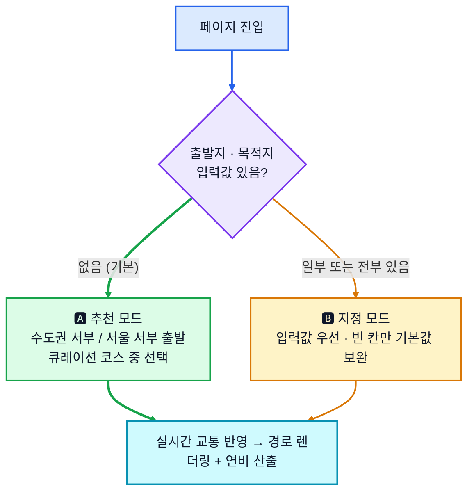
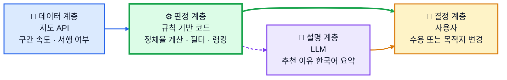
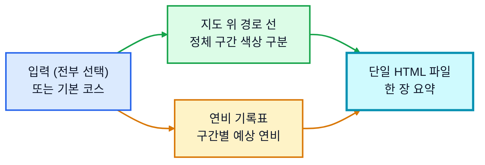
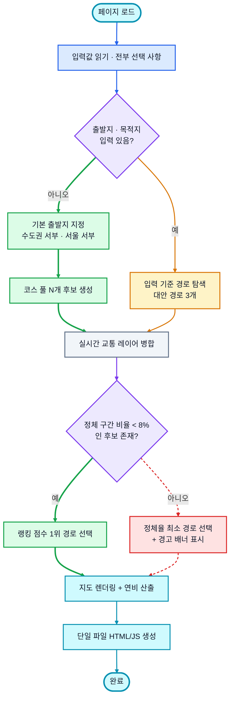
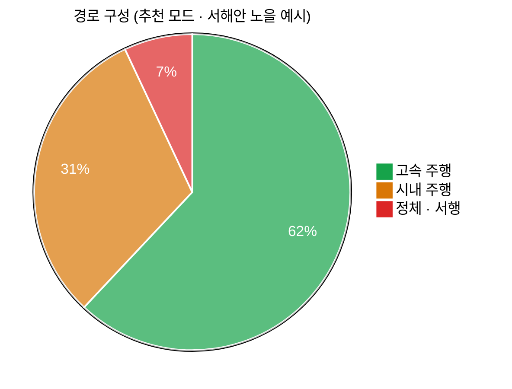
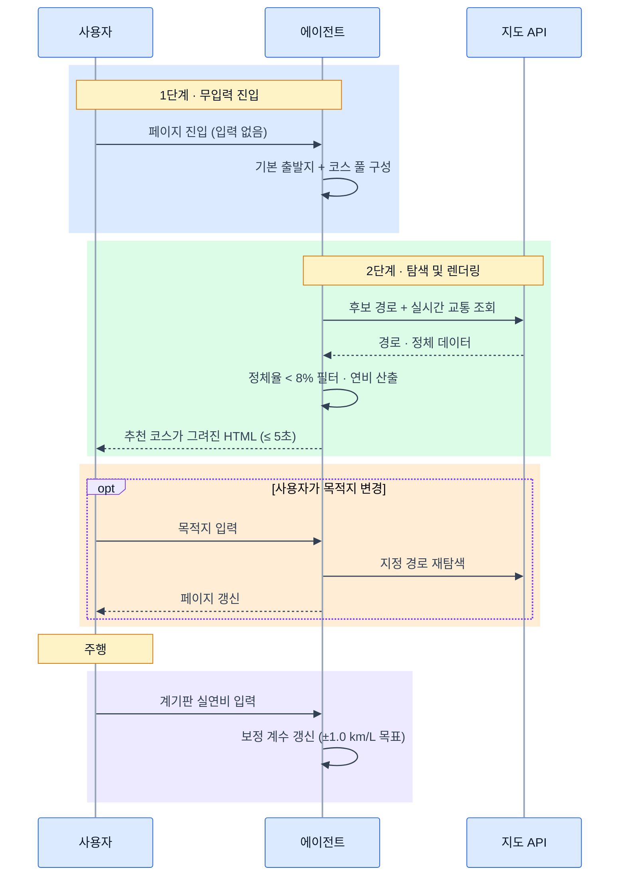

# 🚗 주말 드라이브 코스 & 연비 리포터

주말 드라이브를 즐기는 운전자를 위해 **막히지 않는 코스 탐색**과 **연비 기록**을
한 장의 웹페이지로 정리해 주는 에이전트입니다.

**아무것도 입력하지 않아도** 수도권 서부 / 서울 서부 출발 추천 코스가 바로 그려집니다.

---

## 1. 도메인 맥락

| 항목 | 내용 |
| --- | --- |
| 사용자 | 주말에 드라이브를 즐기는 개인 운전자 |
| 문제 | 매번 정체 구간을 피할 코스를 새로 찾아야 하고, 연비 기록이 흩어져 있음 |
| 원하는 것 | 경로와 연비를 **한 장**으로 요약한 결과물 |
| 사용 시점 | 주말 출발 직전 (실시간 교통 상황 반영 필요) |

---

## 2. 동작 모드

입력을 얼마나 주는지에 따라 두 모드로 갈립니다. **입력 없이도 결과가 나오는 것**이 기본 동작입니다.



| 모드 | 조건 | 동작 |
| --- | --- | --- |
| 🅰 **추천 모드** | 출발지·목적지 모두 미입력 | 기본 코스 풀에서 **랭킹 점수 1위 코스** 자동 선택 (§3.1) |
| 🅱 **지정 모드** | 출발지 또는 목적지 입력 | 입력값 사용, 빈 칸만 기본값으로 채움 |

### 기본 코스 풀 (추천 모드)

출발지는 **수도권 서부 또는 서울 서부** 기준이고, 아래 거리는 모두 **편도**입니다.

#### 거리 표기 규칙

| 표기 | 정의 | 어디에 쓰이는가 |
| --- | --- | --- |
| **편도** | 출발지 → 목적지 단방향 거리 | 코스 풀 표기, 거리 프리셋, 랭킹 점수의 `거리편차` |
| **왕복** | 편도 × 2 (귀로는 동일 경로 가정) | 예상 소요시간, 예상 연비, 검증 기준 V3 비교 |

계기판 연비는 왕복 주행을 마친 뒤 읽는 값이므로, **예상 연비는 왕복 기준으로 산출**해야 V3(±1.0 km/L)과 같은 축에서 비교됩니다. 다만 귀로는 출발 후 2~3시간 뒤 통과하므로 왕복 정체율은 편도 정체율의 단순 2배가 아니며, 귀로 구간은 도착 예정 시각의 예측 교통량을 별도로 적용합니다.

| 코스 | 출발지 (기본) | 목적지 | 성격 | 편도 | 거리 프리셋 |
| --- | --- | --- | --- | --- | --- |
| 아라뱃길 정서진 | 김포 · 검단 | 정서진 · 아라마루 | 수변 · 신호 적음 | 약 25 km | 🚶 가볍게 |
| 소래 · 시흥 해안 | 서울 강서 | 소래포구 · 오이도 | 해안 · 짧은 순환 | 약 35 km | 🚶 가볍게 |
| 영종 공항로 | 청라 · 검단 | 영종 하늘도시 | 직선 고속 · 야간 추천 | 약 40 km | 🚗 보통 |
| 강화 순환 | 서울 강서 · 화곡 | 강화 해안도로 | 섬 순환 · 시내 적음 | 약 55 km | 🛣️ 길게 |
| 서해안 노을 | 김포 · 검단 | 궁평항 · 제방도로 | 해안 · 저정체 | 약 60 km | 🛣️ 길게 |
| 남한강 라인 | 서울 서부 | 양평 두물머리 | 강변 · 고속 비중 높음 | 약 70 km | 🛣️ 길게 |

---

## 3. 판단 주체와 랭킹 규칙

"정체율이 낮은 경로"를 **누가 판단하는가**를 계층으로 분리합니다.



| 계층 | 주체 | 역할 | 판단 권한 |
| --- | --- | --- | --- |
| 데이터 | 지도 API | 구간별 실시간 속도·서행 구간 제공 | 없음 (원자료만) |
| 판정 | **규칙 기반 코드** | 정체율 산출 → 필터 → 점수화 → 순위 결정 | **있음 (최종 후보 선정)** |
| 설명 | LLM | 선정 이유를 한국어 문장으로 요약 | 없음 (경로를 바꾸지 못함) |
| 결정 | 사용자 | 추천 수용 또는 목적지 직접 지정 | 있음 (최상위) |

경로 선택을 LLM이 아닌 **결정론적 코드**에 맡기는 이유는 검증 기준 V2(`정체 구간 비율 < 8%`)를 합격·불합격으로 쓰기 위해서입니다. 같은 입력에 같은 결과가 나와야 측정과 회귀 테스트가 성립합니다. LLM은 이미 정해진 결과를 설명하는 역할만 맡습니다.

### 3.1 랭킹 점수

정체율만으로는 순위가 결정되지 않습니다. 정체율 3% · 편도 90 km 코스와 정체율 7% · 편도 40 km 코스 중 무엇이 나은지 판단할 근거가 없기 때문입니다. 따라서 3개 항목의 가중합으로 점수를 냅니다.

```
score = w1 × (1 − 정체율)
      + w2 × 고속주행비율
      + w3 × (1 − 거리편차)

거리편차 = |코스 거리 − 선호 거리| ÷ 선호 거리   (1.0 초과 시 1.0으로 절단)
```

| 가중치 | 항목 | 기본값 | 근거 |
| --- | --- | --- | --- |
| `w1` | 정체 회피 | **0.5** | 사용자의 1순위 요구 |
| `w2` | 고속 주행 비율 | 0.3 | 연비·주행 만족도에 직결 |
| `w3` | 선호 거리 근접도 | 0.2 | 선택한 프리셋에서 벗어난 코스 감점 |

`선호 거리`는 사용자가 프리셋 버튼으로 고르며, 슬라이더로 직접 값을 넣을 수도 있습니다.

| 프리셋 | 편도 목표 | 왕복 · 예상 소요 | 해당 코스 (예) |
| --- | --- | --- | --- |
| 🚶 가볍게 | 약 **25 km** | 약 50 km · 1시간대 | 아라뱃길 정서진 |
| 🚗 **보통 (기본값)** | 약 **40 km** | 약 80 km · 2시간대 | 영종 공항로 |
| 🛣️ 길게 | 약 **60 km** | 약 120 km · 3시간대 | 서해안 노을, 강화 순환 |
| ✏️ 직접 입력 | 10 ~ 120 km | — | 슬라이더 (5 km 단위) |

- 고속도로 옵션이 `제외`면 `w2`를 0으로 두고 `w1`·`w3`를 각각 0.6 / 0.4로 재정규화합니다.
- 점수 계산은 `정체율 < 8%` 필터를 통과한 후보에만 적용합니다. 통과 후보가 없으면 필터를 해제하고 전체 후보에 같은 점수식을 적용한 뒤 경고 배너를 띄웁니다.

### 3.2 동점 처리

점수 차가 **0.02 이내**면 동점으로 보고 다음 순서로 정합니다.

1. 정체율이 낮은 코스
2. 예상 연비가 높은 코스
3. 코스 풀 등록 순서 (재현성 확보용 최종 타이브레이커)

---

### 3.3 교통 시간축 — 현재 vs 갈 때 vs 올 때

실시간 교통은 **조회한 그 순간**의 값입니다. 편도 40 km만 달려도 40분 뒤의 도로 상황은 다르고, 왕복이면 귀로는 3~4시간 뒤입니다. 그래서 하나의 정체율이 아니라 **4개 시점**을 나눠 계산합니다.


| 시점 | 언제 | 데이터 소스 | 신뢰도 |
| --- | --- | --- | --- |
| **T0** 출발 | 조회 즉시 | 지도 API 실시간 교통 레이어 | 높음 |
| **T1** 도착 | T0 + 편도 소요 | 실시간 + 시간대별 통계 보정 | 중간 |
| **T2** 귀가 출발 | T1 + 체류 시간 | 요일·시간대별 통계 교통량 | 낮음 |
| **T3** 귀가 도착 | T2 + 귀로 소요 | 요일·시간대별 통계 교통량 | 낮음 |

#### 구간별 적용 방식

경로를 소요 시간 순으로 잘라, 각 조각이 **실제로 통과할 시각**의 교통 데이터를 씁니다.

```
구간 i 통과 예정 시각 = 출발 시각 + Σ(이전 구간 소요 시간)
구간 i 정체율 = α × 실시간(i) + (1 − α) × 통계(i, 통과 예정 시각)

α = max(0, 1 − 통과까지 남은 시간 ÷ 90분)
```

즉 **30분 안에 통과할 구간은 실시간 데이터를 2/3 비중으로**, 90분 이후 구간은 통계 예측만 사용합니다. 귀로 전체는 α = 0이므로 사실상 통계 기반입니다.

#### 왕복 정체율과 판정 기준

| 지표 | 계산 범위 | 용도 |
| --- | --- | --- |
| 편도 정체율 | T0 ~ T1 | **검증 기준 V2의 판정 대상** (`< 8%`) |
| 왕복 정체율 | T0 ~ T3 | 예상 연비 산출, 화면 표시용 참고값 |

V2 판정을 **편도(출발 시각 기준)** 로 한정하는 이유는 재현성입니다. 귀로 예측은 통계 기반이라 사후 실측과 어긋날 수 있어 합격·불합격 기준으로 쓸 수 없습니다. 대신 화면에는 귀로 정체율을 **범위**로 표기합니다 — 예: `귀로 예상 정체 6~14% (예측)`.

#### 귀가 시각 가정

| 입력 | 필수 | 기본값 |
| --- | --- | --- |
| 체류 시간 | 선택 | **1시간** (프리셋: 30분 / 1시간 / 2시간 / 당일 무제한) |
| 귀로 경로 | 자동 | 동일 경로 가정, T2 시점 재탐색으로 갱신 가능 |

체류 시간이 길어질수록 T2·T3 예측의 신뢰도가 떨어지므로, **2시간을 초과하면 귀로 정체율을 표시만 하고 랭킹 점수에서 제외**합니다. 사용자가 목적지 도착 후 페이지를 다시 열면 그 시점의 실시간 데이터로 귀로를 재탐색합니다.

---

## 4. 동작 분석

### 4.1 분해 — 입력 항목

| 입력 | 필수 여부 | 미입력 시 동작 |
| --- | --- | --- |
| 현재 위치 | 선택 | 브라우저 Geolocation → 거부 시 기본 출발지 |
| 출발지 좌표 | 선택 | **수도권 서부 / 서울 서부** 기본 좌표 |
| 목적지 좌표 | 선택 | **기본 코스 풀**에서 자동 선택 (추천 모드) |
| 고속도로 포함 여부 | 선택 | 기본값 `포함` |
| 선호 거리 | 선택 | 기본값 `보통` (편도 약 40 km) |
| 체류 시간 | 선택 | 기본값 `1시간` (귀로 교통 예측용) |
| 실시간 정체율 | 자동 수집 | 지도 API의 실시간 교통 레이어 |
| 고속/시내 비율 | 자동 산출 | 경로 구간별 도로 등급 합산 |
| 실연비 이력 | 선택 | 차종 공인연비로 대체 (오차 범위 함께 표기) |

### 4.2 패턴 — 추천 규칙

| 패턴 | 판정 기준 | 비고 |
| --- | --- | --- |
| 주말 저정체 구간 | **편도** 정체율 **< 8%** | 필터 조건 · 통과 후보만 점수화 (§3.3) |
| 고속 주행 비율 | 고속도로 옵션에 따라 재계산 | `포함` 시 상향, `제외` 시 0% |
| 예상 연비 | 고속·시내·정체 3구간 가중 평균 | 아래 5.2 참조 |

### 4.3 추상화 — 산출물



### 4.4 알고리즘 — 처리 흐름



---

## 5. 계산 방식

### 5.1 구간 분류



### 5.2 예상 연비 산식

구간별 연비에 **거리 가중 조화평균**을 적용합니다.
(단순 산술평균은 연비를 과대평가하므로 사용하지 않습니다.)

```
예상 연비 = 왕복 총 거리 ÷ Σ ( 구간 거리 ÷ 구간 연비 )
```

`왕복 총 거리 = 편도 × 2`이며, 갈 때와 올 때의 정체 구간 비율을 각각 따로 계산해 합산합니다.

| 구간 | 기준 연비 | 보정 요소 |
| --- | --- | --- |
| 고속 | 공인 고속연비 × 1.00 | 평균 속도, 경사 |
| 시내 | 공인 복합연비 × 0.85 | 신호 정지 횟수 |
| 정체 | 공인 복합연비 × 0.55 | 서행 지속 시간 |

---

## 6. 출력 요구

| 항목 | 사양 |
| --- | --- |
| 형식 | **단일 파일** 웹페이지 (HTML + 인라인 CSS/JS) |
| 지도 | 탐색된 경로가 지도 위에 **직접 렌더링** |
| 언어 | 한국어 |
| 구성 | 상단 지도 · 하단 연비 기록표 (한 화면 스크롤 이내) |
| 첫 화면 | **입력 없이도** 추천 코스가 그려진 상태로 시작 |

### 6.1 "단일 파일"의 범위

지도 타일과 실시간 교통은 런타임에 외부 호출이 필요하므로 완전한 자기완결은 불가능합니다. 범위를 이렇게 한정합니다.

| 구분 | 방침 |
| --- | --- |
| 산출물 파일 수 | **1개** (HTML + 인라인 CSS/JS, 빌드 단계 없음) |
| 외부 스크립트 | 허용 — 지도 SDK를 `<script src>` 한 줄로 로드 |
| 외부 데이터 | 허용 — 지도 타일, 경로 탐색, 실시간 교통 |
| 로컬 상태 | `localStorage` (차종·실연비 이력·프리셋 선택) |
| 오프라인 | 정적 SVG 경로로 **기능 축소 동작** (§6.3) |

### 6.2 경로 렌더링 방식

경로는 이미지가 아니라 **좌표 배열(polyline)** 로 받아서 지도 위에 벡터로 그립니다. 정체 구간을 색으로 구분해야 하므로 선 하나가 아니라 **교통 등급이 바뀌는 지점에서 쪼갠 여러 개의 선**을 이어 붙입니다.


#### 단계별 상세

| 단계 | 입력 | 처리 | 출력 |
| --- | --- | --- | --- |
| ① 탐색 | 출발·목적지 좌표, 옵션 | 경로안내 API 호출 (`trafficInfo=Y`) | GeoJSON `FeatureCollection` |
| ② 파싱 | `Feature.geometry.coordinates` | `[lng, lat]` 배열 추출 · 좌표계 확인(EPSG:4326) | 정점 배열 |
| ③ 분할 | 정점 배열 + 구간 교통 등급 | 등급이 바뀌는 인덱스에서 잘라 세그먼트 생성 | 세그먼트 N개 |
| ④ 생성 | 세그먼트별 좌표 | `Polyline` 객체 생성, 등급별 `strokeColor` 지정 | 지도 위 선 |
| ⑤ 맞춤 | 전체 정점 | `LatLngBounds`에 누적 후 `setBounds` | 화면에 경로 전체 표시 |
| ⑥ 장식 | 출발·목적지·경유지 | 마커, 색상 범례, 구간 클릭 툴팁 | 완성된 지도 |

#### 정체 등급별 색상

| 등급 | 평균 속도 (일반도로 기준) | 색상 | 선 굵기 |
| --- | --- | --- | --- |
| 원활 | 30 km/h 이상 | `#16a34a` 초록 | 6 px |
| 서행 | 15 ~ 30 km/h | `#d97706` 주황 | 6 px |
| 정체 | 15 km/h 미만 | `#dc2626` 빨강 | 7 px |
| 예측 구간 (귀로) | 통계 기반 | 해당 색상 + `opacity 0.55` 점선 | 5 px |

예측 구간을 점선·반투명으로 구분하는 이유는 §3.3의 신뢰도 차이를 화면에서도 드러내기 위해서입니다. 실시간 데이터로 확정된 구간과 통계 예측 구간이 같은 실선으로 그려지면 사용자가 예측을 사실로 오해합니다.

#### 세그먼트 분할 (의사 코드)

```js
function splitByTraffic(coords, levels) {
  const segments = [];
  let start = 0;
  for (let i = 1; i <= coords.length - 1; i++) {
    if (levels[i] !== levels[start] || i === coords.length - 1) {
      segments.push({ path: coords.slice(start, i + 1), level: levels[start] });
      start = i;                       // 끊긴 선이 보이지 않도록 정점 1개를 공유
    }
  }
  return segments;
}
```

정점을 공유하지 않고 자르면 세그먼트 사이에 1픽셀 틈이 생겨 경로가 끊어져 보입니다.

### 6.3 지도 SDK 선택과 폴백

| 후보 | 경로 탐색 | 국내 실시간 교통 | 판단 |
| --- | --- | --- | --- |
| **TMAP API** | ✅ 자동차 경로안내 | ✅ 구간별 교통 등급 | **1순위** — 교통 데이터가 가장 상세 |
| Kakao Maps + Navi | ✅ 길찾기 | ⚠️ 요약 수준 | 2순위 — 지도 표현이 익숙 |
| Naver Maps (NCP) | ✅ Directions 5 | ✅ 옵션 제공 | 2순위 — 유료 쿼터 확인 필요 |
| Leaflet + OSM | ❌ 별도 라우터 필요 | ❌ 없음 | 폴백 렌더러로만 사용 |


폴백 SVG는 타일 없이 경로 형태만 보여줍니다. 정체 색상이 없으므로 §7의 V2는 측정 불가 상태로 기록하고, 화면에 `실시간 교통 데이터 없음`을 명시합니다.

### 6.4 성능 — V1의 5초를 지키는 방법

| 기법 | 효과 |
| --- | --- |
| 추천 모드 코스 풀을 좌표로 하드코딩 | 지오코딩 호출 0회 |
| 후보 경로 요청 3개를 병렬 발사 | 순차 대비 약 1/3 시간 |
| 정점 단순화 (Douglas–Peucker, 허용오차 8 m) | 폴리라인 정점 수 60~80% 감소 |
| 지도 SDK를 `async` 로드하고 응답 대기와 겹침 | 초기 렌더 지연 흡수 |
| 첫 렌더는 1순위 경로만, 대안 경로는 지연 렌더 | 첫 화면 도달 시간 단축 |

V1의 측정 구간에서 지도 타일 로딩을 제외하는 이유가 여기 있습니다. 타일은 외부 CDN 지연이라 애플리케이션이 통제할 수 없고, 경로 폴리라인은 타일보다 먼저 그려질 수 있습니다.

---

## 7. 검증 기준

| # | 항목 | 기준 | 측정 방법 |
| --- | --- | --- | --- |
| V1 | 추천 속도 | 입력 완료 → 경로 렌더링 완료 **≤ 5초** | 자체 처리 + 첫 렌더까지 실측 (지도 타일 로딩 제외) |
| V1' | 무입력 초기 렌더 | 페이지 로드 → 추천 코스 렌더링 **≤ 5초** | 추천 모드 기준, 동일 측정 구간 |
| V2 | 정체 최소화 | 추천 **편도** 경로의 서행 구간 비율 **< 8%** | 출발 시각(T0) 기준 실시간 교통 데이터 |
| V2' | 귀로 예측 표기 | 귀로 정체율을 **범위**로 명시 | 통계 예측이므로 합격 판정 대상 아님 |
| V3 | 연비 오차 | 예상 연비 vs 계기판 연비 **±1.0 km/L** | 주행 완료 후 사용자 입력값과 비교 |

### 검증 루프



---

## 8. 남은 이슈

| 이슈 | 현재 판단 |
| --- | --- |
| 추천 코스가 사용자 실제 위치와 멀 수 있음 | Geolocation 허용 시 코스 풀을 거리순 재정렬 |
| 귀로 통계 예측의 정확도 | §3.3의 시간 가중 모델로 완화. 실측 누적 후 통계 가중치 재학습 필요 |
| 주말 통계 표본 부족 구간 | 표본 30건 미만 구간은 예측 대신 `데이터 부족`으로 표기 |
| 차종별 연비 편차 | 최초 1회 차종 등록 후 실연비로 개인화 |
| 지도 API 요금·쿼터 | 추천 모드에서도 후보 경로 요청을 3개로 제한 |
