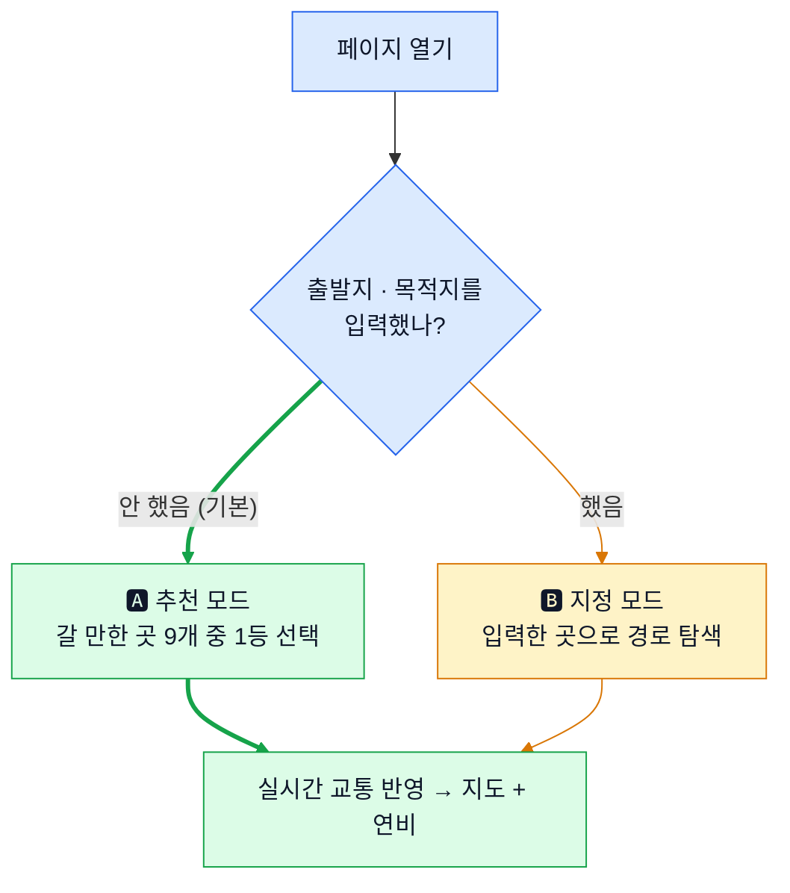
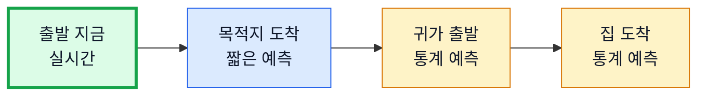

# 상세 설계 — 주말 드라이브 코스 & 연비 리포터

판단 규칙과 산식을 항목별로 적은 문서입니다. 전체 구조와 요약은 [SPEC.md](SPEC.md), 실행·배포·검증은 [OPERATIONS.md](OPERATIONS.md)를 보세요.

## 1. 코스를 어떻게 고르나

| 단계 | 하는 일 | 세부 |
| --- | --- | --- |
| ① | 출발지 | 브라우저에 위치를 물어봄. 거부하면 광화문·강서구청·김포 중 하나 |
| ② | 거리 범위 | "보통(편도 40km)"이면 직선 18~36km. 도로는 직선의 1.35배쯤 돌아가므로 더 좁게 |
| ③ | 후보 검색 | 카카오 장소 검색의 **관광명소** 한 종류로 최대 15곳 조회 |
| ④ | 9곳 고르기 | 같은 방향 최대 2곳 · 1.5km 안의 비슷한 장소는 하나만 · 리뷰 30개·평점 3.5 이상(⚠️ 아래) |
| ⑤ | 성격 라벨 | 장소 **이름 패턴**으로 "해안"·"강변"·"산복도로" 판정 + 대략 거리. 경로를 안 봤으니 **(추정)** 표시 |
| ⑥ | 상위 3곳만 경로 조회 | 9곳 다 조회하면 5초 초과. 나머지 6곳은 화면 뜬 뒤 뒤에서 채움 |

- 미리 정해둔 코스 목록이 없고 열 때마다 새로 만듭니다. 9곳이 안 모이면 허용 범위를 두 번(1.15배씩) 넓혀 **다시 걸러 봄** — 장소를 새로 검색하진 않아 후보 풀은 15곳 고정. 그래도 부족하면 **모인 만큼만**
- ⚠️ **리뷰·평점 기준은 실제로는 작동하지 않음** — 카카오 장소 검색이 평점·리뷰 수를 주지 않아 값이 비어 있고, 코드는 값이 없으면 통과시킴. 가짜 데이터에서만 걸러짐
- **같은 자리에서 다시 열면 같은 결과** — 후보 9곳을 묶어 식별 번호로 기록, 위치도 100m 단위로 반올림
- **편도 vs 왕복** — 거리·거리 설정은 편도, 연비·소요 시간은 왕복. 계기판 연비는 왕복을 마치고 읽는 값이라 축을 맞춰야 함

## 2. 순위는 누가, 어떻게 매기나

- 판단은 AI가 아니라 **정해진 규칙 코드.** 외부 서비스는 원자료만 주고 사용자는 최종 결정권(목적지 직접 지정)을 가짐. AI에게 안 맡긴 이유는 **같은 조건에 항상 같은 답이 나와야** 하기 때문 — "정체 8% 미만" 통과를 검사하려면 어제와 오늘 판단이 같아야 함
- 정체율만으로는 순위가 안 나옴("정체 3%·편도 90km" vs "정체 7%·편도 40km") → 세 항목을 합산

| 무엇을 보는가 | 비중 | 고속도로 "제외" 시 |
| --- | --- | --- |
| 정체가 적은가 | **50%** | 60% |
| 고속도로 비중이 높은가 | 30% | 0% (삭제) |
| 원한 거리와 비슷한가 | 20% | 40% |

- 점수는 **정체율 8% 미만인 코스에만.** 통과한 코스가 없으면 기준을 풀고 가장 덜 막히는 코스 + 화면 알림. 거리 설정은 🚲 15km · 🚗 40km(기본) · 🛣️ 60km · ✏️ 직접 10~120km
- **방향 쏠림 보정** — 서쪽 바닷가는 대체로 안 막혀 상위권이 쏠림 → 같은 방향 두 번째 코스는 5% 감점. 후보 4개 미만이면 건너뜀
- **동점 처리** — ① 덜 막히는 쪽 → ② 연비 좋은 쪽 → ③ 장소 번호 순 (매번 바뀌는 값을 쓰면 재현이 깨지므로)

## 3. "지금 안 막힌다"가 3시간 뒤에도 맞을까

- 실시간 교통은 **조회한 그 순간**의 값. 편도 40km도 도착은 40분 뒤, 왕복이면 귀가는 3~4시간 뒤
- 경로를 조각내어 **각 조각을 지나갈 시각**의 정보를 씀. 기준선 **90분** — 30분 내 통과 구간은 실시간을 3분의 2쯤 반영, 90분 넘으면 통계만. 돌아오는 길은 전부 통계
- **합격 판정은 가는 길만** — 돌아오는 길은 통계 예측이라 맞았다/틀렸다를 못 따짐. 그래서 `귀로 예상 정체 6~14% (예측)`처럼 **범위로만** 적고 지도에서도 **점선·반투명**(단일 숫자는 예측을 사실로 오해하게 함)
- 머무는 시간 기본 1시간(30분/1·2시간/무제한 선택). 귀로 정체율은 **애초에 순위 계산에 안 들어가고 표시 전용** — 머문 시간에 따라 다르게 취급하는 로직은 없음

| 통계 출처 | 방법 | 상태 |
| --- | --- | --- |
| 1순위 | TMAP "미래 시각 길찾기"를 귀가 시각으로 1회 조회 (화면 뜬 뒤 → 5초와 무관) | 동작 |
| 2순위 | 앱 내장 시간대별 속도 표 (도로 4종류 × 주말 6시간대 = 24개 값) | 동작 · 실패 불가 |
| 3순위 | 사용자 실제 주행 기록으로 보정 | **미구현** |

## 4. 연비와 기름값

- **정체 판정** — 원활 30km/h 이상 · 서행 15~30km/h · 정체 15km/h 미만
- **구간 연비** — 고속은 공인 고속연비 그대로, 시내는 공인 복합연비의 85%, 정체는 55%
- 구간마다 연비가 달라 **거리를 감안해 평균.** 산술평균은 실제보다 좋게 나옴 → 100km를 20km/L, 100km를 10km/L로 달리면 평균은 15가 아니라 **13.3km/L**
- 기름값 = `(왕복 거리 ÷ 예상 연비) × 1리터 가격`. 전국 평균가를 받아 쓰고 실패하면 내장 값(휘발유 1,861원 등) — 못 받았다고 칸을 비우지 않음
- 차량 정보는 고정값(고속 15.0 / 복합 12.0 km/L). 계기판 연비 입력 화면이 없어 보정 기능은 설계만 있고 미동작

## 5. 식당 · 카페 추천 (선택 기능)

| 자리 | 어디쯤 | 언제 |
| --- | --- | --- |
| 🍚 가는 길 식사 | 편도 60% 지점 | 그 시각이 11~14시 또는 17~21시 |
| ☕ 가는 길 카페 | 편도 80% 지점 | 그 시각이 10~22시 |
| ☕ 오는 길 카페 | 목적지 근처 | 돌아올 때가 카페 시간대 |
| 🍚 오는 길 식사 | 목적지 근처 | 집 도착 시각이 식사 시간대 |

- 기본 켜짐 · 최대 4곳. 화면이 다 뜬 **다음에** 조회하므로 5초를 방해하지 않음
- 시간이 안 맞는 자리는 비움 — 아침 9시에 15km 코스면 식사 자리가 아예 안 생김
- **조건** — 경로 2km 내 · 한식 계열 · 리뷰 15개·평점 4.0 이상(⚠️ 목적지와 같은 이유로 실 데이터에서 무효)
- **점수** — 평점 40% · 우회 시간 짧을수록 30% · 리뷰 수 20% · 주차 10%. 카페는 리뷰에 "뷰·테라스·루프탑·창가·노을·전망·오션·리버"가 나오면 가점
- ⚠️ **영업시간은 확인하지 않음** — 카카오가 안 주므로 전부 `영업 여부 미확인` 표시 + 0.1 감점만. **문 닫은 곳이 추천될 수 있음**
- **시간 제한** — 한 곳 10분, 전체 25분. 3번 시도해 못 찾으면 포기하고 **이유를 화면에 적음**("우회 10분 초과") — 빈칸만 남기면 고장 난 줄 알기 때문
- 우회 시간은 경로 재조회 없이 **직선거리로 대충 계산**(자리마다 재조회하면 호출이 12번까지 늘어 사용량 초과). 그 대가로 **경유지를 넣으면 연비가 다시 계산되지 않는 문제**가 남음

## 6. 지도에 그리는 방법

- 경로는 그림 파일이 아니라 **좌표 목록**으로 받아 선으로 직접 그림. 색은 원활 초록 · 서행 주황 · 정체 빨강 · 예측 구간은 같은 색 + 점선·반투명
- 색을 구분하려면 상태가 바뀌는 지점마다 선을 잘라 이어 붙여야 하고, 이때 **이음새의 점 하나를 양쪽이 공유**해야 함 — 안 하면 1픽셀 틈이 생겨 경로가 끊어져 보임
- 배경 우선순위 — TMAP → 오픈 지도(OSM) → 배경 없이 경로 모양만 (§전체 그림 참조)
- **5초를 지키는 방법** — 검색 결과의 좌표를 그대로 써서 변환 생략, 상위 3곳만 동시 조회, 좌표 개수 줄여 그리기, 식당·귀로 조회는 화면 뜬 뒤로 미룸. 배경 로딩은 측정 제외(외부 서버 사정)
