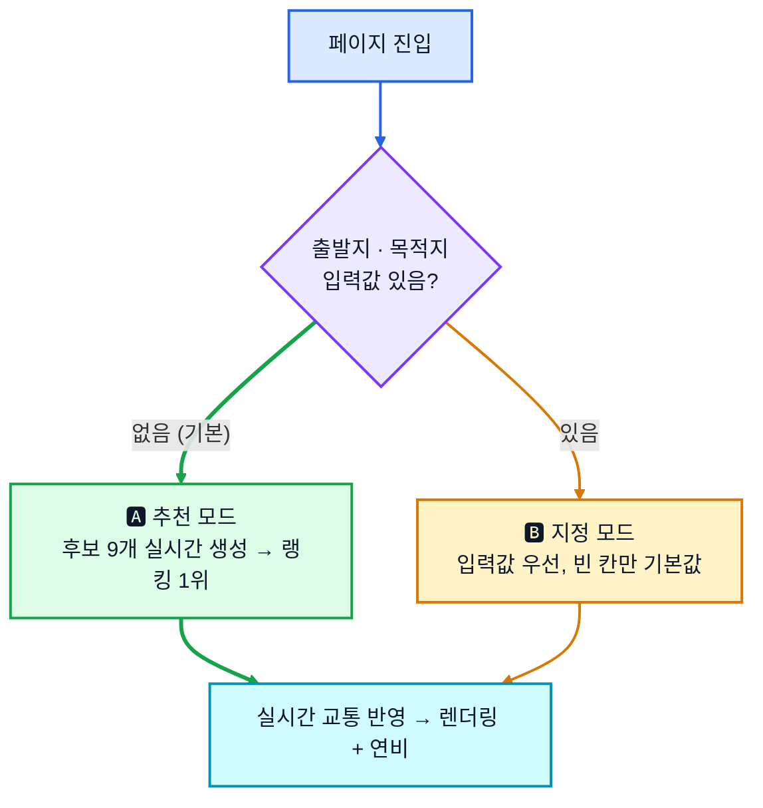
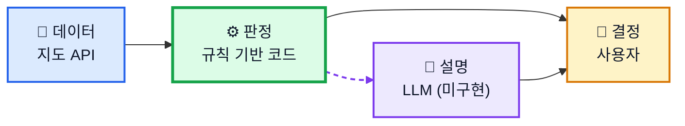
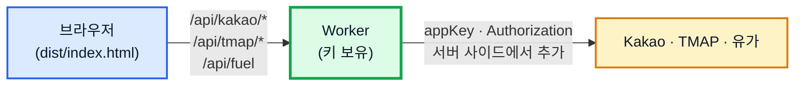

이 문서는 판단 규칙·산식·아키텍처의 근거를 담은 상세 스펙입니다. 실행·배포는 [README.md](README.md)를 보세요.

# 설계 스펙 — 주말 드라이브 코스 & 연비 리포터

**아무것도 입력하지 않아도** 서울 중심부 ~ 수도권 서부 기준으로 정체 없는 코스를 그 자리에서 만들어 지도에 그려 줍니다. 예상 연비 · 예상 기름값을 같이 내고, 원하면 가는 길 · 오는 길의 한식 식당과 카페까지 얹습니다.

**배포:** https://smooth-drive.rome777.workers.dev
**로컬 실행:** `python3 server.py 4173` → `http://localhost:4173`

| 항목 | 내용 |
| --- | --- |
| 사용자 | 주말에 드라이브를 즐기는 개인 운전자 |
| 문제 | 안 막히는 코스를 매번 새로 찾고, 연비·기름값·들를 곳을 따로따로 검색함 |
| 해결 | 경로 · 연비 · 경유지를 **한 장**으로 요약. 입력은 전부 선택 |

---

## 1. 동작 모드



### 추천 모드 — 코스를 그 자리에서 만든다

고정된 코스 목록은 없습니다. 페이지 진입 시점에 출발지·목적지 쌍 **9개**를 실시간으로 만듭니다. 문서에 남는 고정값은 위치를 못 받았을 때 쓸 출발 앵커 3개(Z1 광화문 · Z2 강서구청 · Z3 김포)뿐이고, 이것도 좌표 하나씩입니다.

| 단계 | 하는 일 | 외부 호출 |
| --- | --- | --- |
| ① 출발지 확정 | Geolocation을 100m 그리드로 스냅, 거부 시 존 앵커 | 없음 |
| ② 반경 밴드 | `직선거리 밴드 = 편도 목표 × 0.6~1.2 ÷ 우회계수` | 없음 |
| ③ 후보 수집 | 밴드 안에서 카테고리별 목적지 POI 검색 | 1회 |
| ④ 9개 선별 | 방위 분산(8방위 중 최대 2개) · 거리 적합 · 리뷰 30↑ 평점 3.5↑ · 반경 1.5km 중복 제거 · `(밴드중심거리, POI id)` 정렬 | 없음 |
| ⑤ 라벨 산출 | 카테고리 → 성격(해안/강변/산복도로 등), 직선거리×우회계수 → 대략 편도거리, `(추정)` 표기 | 없음 |
| ⑥ 경로 탐색 | **상위 3개만** 우선 탐색, 나머지 6개는 첫 렌더 뒤 백그라운드로 순차 탐색 | 3회 (세션당 최대 9회) |

9개를 다 탐색하면 5초 예산(§8 V1)이 깨져서 3개만 먼저 봅니다. 9개를 못 채우면 밴드를 1.15배씩 최대 2회 넓히고, 그래도 부족하면 모인 만큼만 냅니다 — 품질 기준을 낮춰 숫자를 채우지 않습니다.

**재현성:** 고정 풀이 없으면 "같은 입력에 같은 결과"가 흔들립니다. 그래서 후보 9개(POI id·좌표·밴드·출발 그리드)를 해시해 `courseSetId`로 스냅샷 저장합니다. 같은 자리(100m 그리드)에서 같은 조건이면 언제 다시 열어도 같은 후보 집합·같은 1위가 나옵니다.

**거리 표기:** 코스·프리셋은 전부 **편도** 기준입니다. 계기판 연비는 왕복을 마친 뒤 읽는 값이라 **예상 연비·소요시간은 왕복(편도×2) 기준**으로 계산합니다.

---

## 2. 판단 계층과 랭킹

"정체율이 낮은 경로"를 **누가 정하는가**를 네 계층으로 분리합니다.



경로 선택을 **결정론적 코드**에 맡기는 이유는 검증 기준(V2 `정체율 < 8%`)을 합격·불합격으로 쓰려면 같은 입력에 같은 결과가 나와야 하기 때문입니다. LLM은 이미 정해진 결과를 설명하는 자리이고, 현재는 이 층이 비어 있어 규칙 기반 템플릿 문장으로 대신합니다.

### 랭킹 점수

```
score = w1 × (1 − 정체율) + w2 × 고속주행비율 + w3 × (1 − 거리편차)
거리편차 = |코스 거리 − 선호 거리| ÷ 선호 거리   (1.0 초과 시 절단)
```

| 가중치 | 항목 | 값 | 비고 |
| --- | --- | --- | --- |
| `w1` | 정체 회피 | **0.5** | 고속도로 `제외` 시 0.6으로 재정규화 |
| `w2` | 고속 주행 비율 | 0.3 | 고속도로 `제외` 시 0 |
| `w3` | 선호 거리 근접도 | 0.2 | 고속도로 `제외` 시 0.4로 재정규화 |

점수는 `정체율 < 8%` 필터를 통과한 후보에만 매깁니다. 통과 후보가 없으면 필터를 풀고 전체 후보 중 최저 정체율 경로를 고른 뒤 경고 배너를 띄웁니다.

| 선호 거리 프리셋 | 편도 목표 | 후보 생성 직선 밴드 |
| --- | --- | --- |
| 🚶 가볍게 | 15 km | 7~13 km |
| 🚗 보통 (기본) | 40 km | 18~36 km |
| 🛣️ 길게 | 60 km | 27~53 km |
| ✏️ 직접 | 10~120 km (5km 단위) | 같은 식으로 환산 |

**방위 쏠림 보정** — 서쪽 해안 목적지는 대체로 정체율이 낮아 상위권이 한 방향으로 쏠리기 쉽습니다. 같은 방위(±22.5°)의 2번째 후보에 `score × 0.95`를 적용하되, 후보가 4개 미만이면 건너뜁니다(방위 쏠림은 코스 품질이 아니라 후보 집합 구성 문제라서).

**동점 처리** — 점수 차 0.02 이내면 ① 정체율 낮은 순 → ② 예상 연비 높은 순 → ③ 목적지 `POI id` 사전순. 마지막 기준을 id로 둔 것은 매번 순서가 바뀌는 값으로는 `courseSetId` 리플레이가 재현되지 않기 때문입니다.

---

## 3. 언제의 정체율인가 — 교통 시간축

실시간 교통은 조회 순간의 값입니다. 편도 40km만 달려도 도착은 40분 뒤, 왕복이면 귀로는 3~4시간 뒤입니다. 그래서 시점을 4개로 나눕니다.


경로를 소요 시간 순으로 잘라, 각 조각이 통과할 시각의 데이터를 씁니다.

```
구간 정체율 = α × 실시간 + (1 − α) × 통계         α = max(0, 1 − 통과까지 남은 시간 ÷ 90분)
```

30분 내 통과 구간은 실시간을 2/3 비중으로, 90분 이후는 통계만 씁니다. 귀로는 α=0이라 사실상 통계 기반입니다.

**판정은 편도(T0~T1)로 한정합니다.** 귀로는 통계 예측이라 재현성이 없어 합격 기준으로 못 씁니다. 화면에는 범위로만 씁니다 — `귀로 예상 정체 6~14% (예측)`.

### 통계는 어디서 오나 — L1 → L2 → L3

| 소스 | 방법 | 정밀도 | 상태 |
| --- | --- | --- | --- |
| **L1** | TMAP 타임머신 길안내(`routes/prediction`)를 귀가 출발 시각 1회 호출 | 링크 단위 | 동작 |
| **L2** | 인라인 시간대 계수 테이블(도로 4등급 × 주말 6시간대 = 24값) × 자유흐름 속도 | 등급 단위 | 동작. 실패하지 않아 최종 폴백 |
| **L3** | 사용자 실측 누적 보정 계수 | 구간 단위 | **미구현** — 표본을 읽기만 하고 쌓지 않아 항상 `0/30` |

L1은 귀로 1건(확정된 1위 코스)만 필요해 호출 1회로 끝나고, 첫 렌더 뒤 비동기로 돌아 5초 예산 밖에 있습니다. L1이 실패하면 L2(인라인 상수라 실패하지 않음)로 내려갑니다. `predictionType`은 이름이 반대라 실측으로 확인했습니다 — `arrival`을 써야 원하는 시각을 **출발** 시각으로 해석합니다.

체류 시간 기본값은 **1시간**(프리셋: 30분/1시간/2시간/무제한)이고, **2시간 초과면 귀로 정체율을 랭킹에서 제외**하고 표시만 합니다(예측 신뢰도가 더 떨어지므로).

---

## 4. 계산 방식

**정체 판정 기준:** 편도 정체율 < 8% (원활 ≥30km/h · 서행 15~30 · 정체 <15km/h)

**연비** — 거리 가중 조화평균(산술평균은 과대평가되므로 사용 안 함):

```
예상 연비 = 왕복 총 거리 ÷ Σ(구간 거리 ÷ 구간 연비)
```

| 구간 | 기준 연비 |
| --- | --- |
| 고속 | 공인 고속연비 × 1.00 |
| 시내 | 공인 복합연비 × 0.85 |
| 정체 | 공인 복합연비 × 0.55 |

차량 제원은 공인연비 고정값(고속 15.0 / 복합 12.0 km/L)입니다. 실연비 입력 UI가 없어 V3(±1.0km/L) 보정 루프는 설계만 있고 동작하지 않습니다.

**유가·기름값:**

```
예상 기름값 = (왕복 총 거리 ÷ 예상 연비) × 유종 단가
```

초기 단가(휘발유 1,861원 · 고급 2,320원 · 경유 1,845원)는 `/api/fuel`에서 전국 주유소 평균가를 받아 갱신됩니다. 실패하면 초기값을 그대로 씁니다 — 값을 못 받았다고 칸을 비우지 않습니다. 선택 유종은 `localStorage`에 남습니다.

---

## 5. 경유지 추천 — 한식 식당 · 카페 (선택)

기본 **켜짐**. 정체 회피가 1순위 요구(w1=0.5)라, 경유지는 경로를 크게 흔들지 않는 범위에서만 붙습니다. 첫 렌더가 끝난 뒤 비동기로 조회해 5초 예산에 끼어들지 않습니다.

| 슬롯 | 기준 지점 | 조건 |
| --- | --- | --- |
| 🍚 가는 길 식사 | 편도 60% | 식사 시간대(11~14시 또는 17~21시) |
| ☕ 가는 길 카페 | 편도 80% | 카페 시간대(10~22시) |
| ☕ 오는 길 카페 | 목적지 | 귀가 출발(T2)이 카페 시간대 |
| 🍚 오는 길 식사 | 목적지 | 귀가 도착(T3)이 식사 시간대 |

조건 안 맞는 슬롯은 비웁니다. 최대 4슬롯, 우회 시간 합계 25분이 실제 개수를 더 제한합니다. 오는 길 슬롯은 통계 예측(α=0) 위에 있어 `예상` 배지가 붙습니다.

**필터(전부 통과):** 경로 2km 이내 · 통과 시각에 영업 중 · 리뷰 15건↑ · 평점 4.0↑ · 한식 계열

```
POI 점수 = 0.4×평점 + 0.3×(1 − 우회시간÷10분) + 0.2×리뷰수 + 0.1×주차가능 + 0.08×조망키워드(카페만) − 0.10×영업시간미확인
```

**우회 비용:** 슬롯당 10분·합계 25분 초과, 또는 3회 교체 실패 시 슬롯 포기(사유 표기). 우회 시간은 경로 재탐색이 아니라 **직선거리 근사**로 냅니다 — 슬롯마다 재탐색하면 최대 12회 호출이 붙어 쿼터를 깨기 때문입니다. 이 근사 때문에 "경유지로 인한 정체율 상승 2%p 이하" 검증(V4)과 **경유지 반영 연비 재산출은 아직 미구현**입니다.

POI는 Kakao Local 우선(국내 밀도가 가장 높음). "분위기 좋은 카페"는 리뷰 텍스트의 뷰/테라스/루프탑/창가/노을 키워드 비율로 근사합니다.

---

## 6. 출력 · 렌더링

**단일 파일 원칙:** 산출물은 HTML 1개, 빌드 단계 없음. 지도 타일·실시간 교통은 런타임 외부 호출을 허용합니다(완전한 자기완결은 애초에 불가능). 로컬 상태는 `localStorage`(존별 우회계수 학습값, 직전 `courseSetId` 스냅샷, 유종, 테마, API 호출 카운트) — 차종·실연비·프리셋 선택은 세션 한정입니다.

**경로 그리기:** 좌표 배열(polyline)을 벡터로 그립니다. 정체 구간을 색으로 구분해야 해서 등급이 바뀌는 지점마다 선을 쪼갭니다.

```js
// 정점 1개를 공유해야 세그먼트 사이에 1px 틈이 안 생긴다
for (let i = 1; i < coords.length; i++) {
  if (levels[i] !== levels[start] || i === coords.length - 1) {
    segments.push({ path: coords.slice(start, i + 1), level: levels[start] });
    start = i;
  }
}
```

| 등급 | 속도 | 색상 |
| --- | --- | --- |
| 원활 | ≥30 km/h | `#16a34a` 초록 |
| 서행 | 15~30 km/h | `#d97706` 주황 |
| 정체 | <15 km/h | `#dc2626` 빨강 |
| 예측(귀로) | 통계 기반 | 해당 색상 + 점선·반투명 |

예측 구간을 점선으로 구분하는 이유는 §3의 신뢰도 차이를 화면에서도 드러내기 위해서입니다 — 실선으로 같이 그리면 예측을 사실로 오해합니다.

**지도 SDK:** TMAP 1순위(교통 데이터가 가장 상세) → 실패 시 Leaflet+OSM → 그래도 실패하면 좌표를 정적 SVG `<path>`로 그리는 최종 폴백(교통 색상 없음, 경고 배너).

**성능(V1의 5초 예산):** 목적지 좌표를 POI 응답값 그대로 써서 지오코딩 생략, 상위 3개만 병렬 경로 탐색, 정점 단순화(Douglas–Peucker), 경유지 조회·귀로 탐색은 첫 렌더 뒤 비동기로 분리. 지도 타일 로딩은 측정 구간에서 제외합니다(외부 CDN 지연은 통제 밖이라).

---

## 7. 검증 기준

| # | 항목 | 기준 | 측정 가능? |
| --- | --- | --- | --- |
| V1 | 추천 속도 | 첫 렌더까지 ≤ 5초 (타일 제외) | ✅ |
| V1' | 무입력 초기 렌더 | 페이지 로드 → 렌더 ≤ 5초 | ✅ |
| V2 | 정체 최소화 | 편도 서행 비율 < 8% | ✅ |
| V2' | 귀로 예측 표기 | 범위로만 표시, 합격 기준 아님 | ✅ |
| V3 | 연비 오차 | 예상 vs 계기판 ±1.0 km/L | ❌ 실연비 입력 없음 |
| V4 | 경유지 우회 비용 | 슬롯당 ≤10분, 정체율 상승 ≤2%p | ⚠️ 시간만 검사, 정체율 상승 검사 미구현 |
| V4' | 경유지 유효성 | 통과 시각에 영업 중 | ✅ |
| V5 | 후보 생성 | 무입력 시 9개 확보, 실패율 <2% | ✅ |
| V5' | 거리 추정 오차 | 대략거리 vs 실제 ±15% | ✅ |
| V5'' | 생성 재현성 | 같은 `courseSetId` → 같은 1위 | ❌ 스냅샷 리플레이 미구현 |
| V6 | 귀로 예측 오차 | 예측 vs 실측 ±20% | ❌ 실측 입력 없음 (추적 지표) |
| V6' | 통계 단계 분포 | L1 처리 비율 ≥70% | ✅ |

---

## 8. 배포

브라우저가 Kakao/TMAP 키를 직접 들고 있으면 정적 배포 시 그대로 노출됩니다. 특히 Kakao REST 키는 도메인 화이트리스트가 없어서 `Authorization` 헤더만 복사하면 어디서든 쓸 수 있습니다. 그래서 배포판은 **키를 서버(Cloudflare Worker)로 옮기고, 브라우저는 같은 오리진의 `/api/*`만 호출**합니다.



| 로컬 개발 | 배포 |
| --- | --- |
| `config.local.js`의 키로 외부 API 직접 호출 | `window.SD_PROXY = true` → `/api/*`로 우회 |
| `server.py`가 `/api/fuel`만 프록시 | `worker.js`가 `/api/kakao/*` · `/api/tmap/*` · `/api/fuel` 전부 프록시 |
| TMAP JS SDK가 브라우저에서 appKey로 지도 로드 | SDK에 appKey를 못 주므로 처음부터 **Leaflet 폴백**(§6)으로 렌더 |

`index.html`은 `CONFIG.PROXY` 플래그 하나로 두 모드를 같은 파일에서 분기합니다. 빌드는 이 플래그를 켜는 치환 한 줄뿐입니다.

### 지도가 TMAP이 아니라 Leaflet인 이유

프록시는 REST API 호출(`/api/tmap/routes` 등)만 대신해 줄 수 있습니다. TMAP 지도 타일을 그리는 **JS SDK는 브라우저에서 직접 로드되는 스크립트**라 대신할 수 없고, 로드하려면 `<script src="...&appKey=...">` 형태로 appKey가 그대로 URL에 박혀야 합니다. "키를 숨긴 채로 SDK만 로드"는 구조상 불가능합니다.

그래서 배포 빌드는 SDK 로더 자체를 건너뜁니다 — `window.SD_KEYS`가 없으니 `if (!K.tmap) return`에 걸려 스크립트 태그가 만들어지지 않고, `MapView.init()`이 실패로 처리돼 자동으로 **Leaflet + OSM 폴백**(§6)으로 넘어갑니다. 경로선·정체 색상 구분·정체 판정 로직은 실 데이터 그대로 동작하고, 지도 배경 타일만 TMAP 대신 OSM으로 바뀝니다.

**현재는 이 상태를 그대로 둡니다.** TMAP 지도를 배포판에도 쓰려면 appKey를 브라우저에 노출시키거나(위험 감수), TMAP 콘솔에서 이 키에 배포 도메인(`smooth-drive.rome777.workers.dev`)만 도메인 화이트리스트로 걸어 노출을 허용해야 합니다 — 둘 다 하지 않기로 했습니다.

```bash
node build.mjs                              # index.html → dist/index.html (SD_PROXY=true로 치환)
npx wrangler deploy -c wrangler.deploy.toml  # dist/를 정적 자산으로, worker.js를 API로 배포
```

키는 `wrangler secret put TMAP_APP_KEY` / `KAKAO_REST_KEY`로 암호화 저장했고, `wrangler.deploy.toml`은 `.gitignore` 대상입니다.

---

## 9. 실행 (로컬)

```bash
python3 server.py 4173
```

`http://localhost:4173`으로 엽니다. `file://`은 CORS로 막혀 안 됩니다. 키를 안 넣으면 목(mock) 데이터로 동작하고, 판정 로직(후보 생성·랭킹·연비·경유지)은 전부 실제로 돌되 외부 응답만 합성으로 대체됩니다.

키를 넣으려면 저장소 루트에 `config.local.js`(gitignore 대상)를 만듭니다.

```js
window.SD_KEYS = { tmap: 'TMAP appKey', kakao: 'Kakao REST 키', forceMock: false };
```

두 API 모두 도메인 화이트리스트를 쓰므로, 각 콘솔(Kakao: 플랫폼→Web 사이트 도메인 / TMAP: 서비스 URL)에 `http://localhost:4173`을 먼저 등록해야 실 데이터가 붙습니다.

---

## 10. 구현 현황

문서가 앞서고 코드가 뒤따르는 지점들입니다.

**의도적으로 스펙과 다르게 만든 것**

| 항목 | 스펙 | 구현 | 이유 |
| --- | --- | --- | --- |
| SVG 폴백 색상 | 없음 | 등급 데이터 있으면 칠함 | SDK만 없고 데이터는 있는 경우 감출 이유가 없음 |
| 경유지 기본값 | 꺼짐 | 켜짐 | 비동기라 첫 렌더를 늦추지 않음 |
| 경유지 리뷰 하한 | 30건 | 15건 | 목적지보다 POI 밀도가 낮음 |
| 우회 시간 측정 | 재탐색 후 비교 | 직선거리 근사 | 재탐색하면 슬롯당 3배 호출 |

**아직 구현 안 한 것**

| 항목 | 상태 | 영향 |
| --- | --- | --- |
| LLM 설명 계층 | 템플릿 문장으로 대체 | 추천 이유가 정형 문구에 머무름 |
| 경유지 정체율 상승 검증 | 상수만 있고 검사 없음 | V4 일부 측정 불가 |
| 경유지 반영 연비 재산출 | 미반영 | 경유지 켜면 연비가 실제와 어긋남 |
| L3 실측 보정 | 쓰는 경로 없음 | 항상 `보정 없음 · 0/30` |
| 실연비 입력 | UI 없음 | V3 측정 불가 |
| 스냅샷 리플레이 | 저장만 함 | V5'' 측정 불가, POI 지연 시 그대로 대기 |
| 설정 영속화 | 세션 한정 | 새로고침하면 기본값 복귀 |

**알려진 결함:** `server.py`의 유가 파서가 검색 결과 HTML을 정규식으로 긁어 형식 변경에 취약합니다(공공 오피넷 API 전환이 안전).

---

## 11. 남은 이슈

| 이슈 | 현재 판단 |
| --- | --- |
| 위치 거부 시 출발 앵커가 3개뿐 | 실사용자 위치와 멀 수 있음 |
| POI API 장애 시 추천 모드 전체 중단 | 고정 풀을 없앤 대가. 스냅샷 폴백 미구현이라 목 데이터/지정 모드로만 우회 |
| 우회계수 초기값 1.35 | 수도권 평균 가정, 실측 누적 전까지 V5' 오차 위험 |
| L2 계수 테이블 24값 | 가정치. 공공 소통정보로 실측 검증 필요 |
| 지도 API 쿼터 | 세션당 경로 호출 최대 9회, 일일 호출은 `localStorage`로 집계 |
| POI 리뷰 신뢰도 | 30건 미만 배제, 광고성 리뷰 판별은 미해결 |
| "분위기 좋은"의 정의 | 조망 키워드 비율로 근사, 피드백 누적 후 재조정 |
