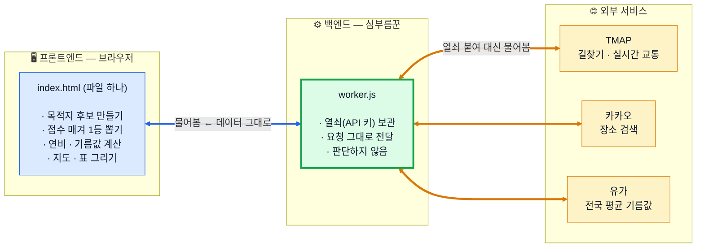
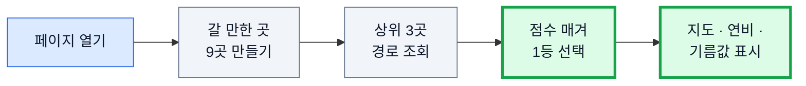

# 설계 개요 — 주말 드라이브 코스 & 연비 리포터

주말에 **안 막히는 드라이브 코스**를 찾아 지도에 그리고, **기름값**까지 계산해 줍니다. 아무것도 입력하지 않아도 열면 바로 추천 코스가 나옵니다.

  

## 구조 — 프론트엔드와 백엔드

- **보통 앱과 반대** — 계산·판단이 전부 브라우저에서 돌아감. 백엔드엔 DB도, 로그인도, 저장된 정보도 **없음**
- 브라우저는 외부 서비스에 직접 연결하지 않고 **항상 백엔드를 거침**
- 백엔드가 있는 이유는 둘 — ① **열쇠 감추기**(브라우저가 들고 있으면 소스 보기로 훔쳐 사용량을 다 써 버림) ② **대신 다녀오기**(기름값처럼 브라우저가 직접 요청하면 차단되는 곳)
- 저장 정보는 브라우저 안에만 — 기름 종류, 화면 밝기, "도로가 직선의 몇 배" 학습값, 오늘 호출 횟수

### 배포판에 TMAP 지도가 안 그려지는 이유

백엔드는 **데이터 요청**(길찾기·장소 검색·유가)은 대신해 줍니다. 하지만 **지도 배경 프로그램**은 브라우저가 직접 내려받아야 하고, 그 주소에 열쇠가 그대로 적혀야 합니다. "열쇠를 감춘 채로 지도만 불러오기"는 불가능합니다.

- 그래서 배포판은 안 불러오고 **오픈 지도(OSM)로 자동 전환.** 의도한 동작이고, 열쇠를 감춘 구조의 대가
- 경로선 · 정체 색상 · 정체 판정은 **전부 진짜 데이터로 동작**(배경 그림만 바뀜). 내 컴퓨터에서는 열쇠가 있어 **TMAP 정상 표시**

## 동작 요약

- 추천 코스 목록을 미리 정해두지 않고 **열 때마다 새로 만듭니다** — 현재 위치에서 원하는 거리쯤 떨어진 관광지를 검색해 9곳을 고릅니다
- 순위는 AI가 아니라 **정해진 규칙**이 매깁니다. 같은 조건에 항상 같은 답이 나와야 검증할 수 있기 때문입니다
- 출발지·목적지를 직접 입력하면 그 경로로 바꿔 줍니다

## 정해둔 기준

| 항목 | 값 |
| --- | --- |
| 화면이 뜨는 목표 시간 | **5초** 안에 (지도 배경 로딩 제외) |
| "안 막힌다"의 기준 | 가는 길 정체 구간 **8% 미만** |
| 점수 비중 | 정체 **50%** · 고속 비중 30% · 원하는 거리 20% |
| 후보 / 경로 조회 | 9곳 만들고 **상위 3곳만** 먼저 조회 (나머지는 화면 뜬 뒤) |
| 거리 설정 | 🚲 15km · 🚗 40km(기본) · 🛣️ 60km · ✏️ 직접 10~120km |
| 들를 곳 | 한식 식당 · 카페 최대 **4곳** (기본 켜짐) |
| 차량 연비 기준 | 고속 15.0 / 복합 12.0 km/L 고정값 |

## 알아둘 한계

- **평점·리뷰로 품질을 못 거릅니다** — 카카오 장소 검색이 그 값을 주지 않습니다
- **영업시간을 확인하지 않습니다** — 문 닫은 식당이 추천될 수 있습니다
- **돌아오는 길은 예측입니다** — 실시간이 아니라 통계 기반이라 화면에도 범위로만 적습니다
- 예상 연비를 실제 계기판 값과 맞춰 보정하는 기능은 아직 없습니다

## 이어지는 문서

- 판단 규칙 · 산식 상세 — [SPEC-DETAIL.md](SPEC-DETAIL.md)
- 실행 · 배포 · 검증 · 현황 — [OPERATIONS.md](OPERATIONS.md) · 한계 전체 목록은 [3. 아직 안 된 것](OPERATIONS.md#3-아직-안-된-것--남은-고민)
